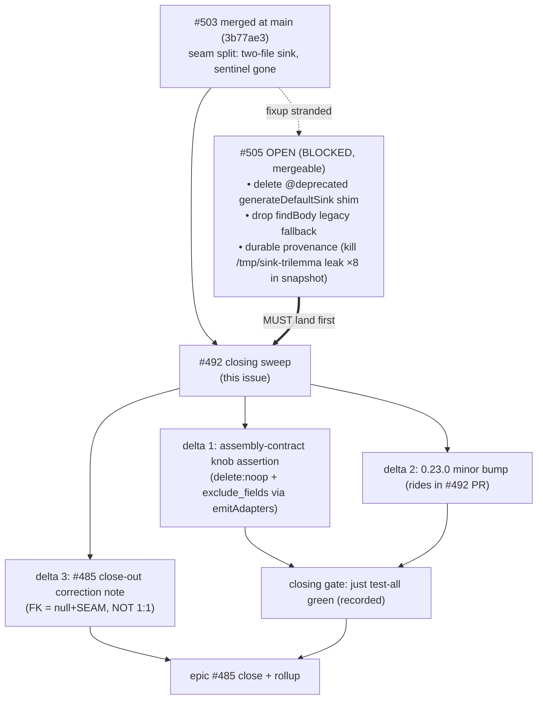

# Sink tests + snapshot re-baseline + closing just test-all (#492)

## Goal

Close the `assembly-default-sinks` stack: verify the integration-emit suites + checked-in snapshot already match the shipped two-file `@generated` sink (most of this landed incrementally across #495/#496/#497/#503), fill the **one** genuine test gap the original AC named (knob-driven delete/exclusion asserted through `emitAdapters` in `assembly-contract.test.ts`), run the explicit closing `just test-all`, land the **0.23.0** minor bump, and write the epic close-out correction note to #485 (its body claims a mechanical 1:1 mapping that the train disproved for FK keys). Strategy only — proportionate to a closing sweep.

## Approach

The stack was planned assuming test updates would trail the code. They didn't: every leaf PR (#495 #487, #496 #488, #497 #490, #503 #491) had to pass `just test-unit` + `test-integration-emit` + `just test-smoke-integration` to merge, so each carried its own test migration + snapshot re-baseline. The audit below (Tests §) walks every original AC and marks it done-in-PR / remaining / superseded. Net: the suites are already migrated and green; this issue is a **verification sweep + three small deltas**, not the large test-authoring task the plan envisioned.



**The #505 dependency is the load-bearing sequencing fact.** #492 `depends_on: [491]`, and #505 is #491's stranded Gate-2.5 fixup (the original #504 was closed; #505 is the clean-base replay, OPEN + MERGEABLE + BLOCKED on main 2026-06-06). #505 itself re-baselines the snapshot (comment-only, killing the `/tmp/sink-trilemma/probe_BConly.ts` leak in 8 snapshot lines) AND edits `sink-emission-generator.test.ts` (−17, deletes the `generateDefaultSink` shim test block) AND `490-sink-knobs-contract.test.ts`. **If #492 lands before #505, the two collide on the snapshot + both test files.** Strategy: **wait for #505 to merge, then branch #492 off the post-#505 main and re-baseline once.** If #505 is abandoned, #492 absorbs its three deltas (they are in #492's natural scope anyway: shim deletion = no-backwards-compat hygiene; provenance = snapshot review item; legacy-fallback = test cleanup). The implementer MUST check #505 state first and rebase accordingly.

**Snapshot review is the deliberate contract artifact.** `test/integration-emit/__snapshots__/snapshot.test.ts.snap` already carries the two-file shape (`meeting.sink.generated.ts` :293 + emit-once `meeting.sink.ts` :388; the `<CODEGEN-SCAFFOLD-V1>` strings at :19/:460 are the *adapter* sentinel, legitimately kept per #491 — NOT a stale sink sentinel). The one cruft item is the `/tmp/sink-trilemma` provenance leak (×8), which #505 removes. The closing review reads the diff once more after #505 to confirm no accumulated cruft — not a rubber-stamp regen.

**Version bump = 0.23.0, in this PR.** The train's 5 PRs merged WITHOUT a bump; main is still `0.22.0`, so none of the sink work has published. Recent convention (`bbb47d7` 0.22.0, `5a76fe2` 0.21.0, `959a28b` 0.18.0) is: feature trains bump the minor and the bump rides *in* the feature PR (title carries `(0.23.0)`). Schema knobs + seam split are minor-version surface. `just bump minor` (justfile:219) sets `0.23.0`; merging to main auto-publishes (CLAUDE.md release flow). The bump belongs in #492's PR — it is the train's natural closing commit, and there is no separate publishing leaf.

## File-level plan

### Create
- _(none — no new files; this is a verification + small-delta sweep)_

### Modify
- `test/integration-emit/assembly-contract.test.ts` — **delta 1 (the one real test gap).** Add a `describe` that drives `emitAdapters` against a fixture entity carrying `integration.sink.delete: noop` + `exclude_fields`, asserting the *generated base* (`*.sink.generated.ts`) reflects both: the `softDeleteByExternalId` body is the logged no-op (delete:noop) and the excluded field is absent from the copy-through write + written as the declared null/sentinel. Today knob behavior is asserted only in the dedicated unit suites (`490-sink-knobs-contract.test.ts`, `sink-policy.test.ts`, `integration-repository-template.test.ts`); the original AC names assembly-contract explicitly ("asserts ... both YAML knobs"). Keep it structural (synthetic-input `expect`s, not raw snapshot bytes — suite header + memory `feedback_smoke_filter_signal`). ~1 describe, ~4 assertions.
- `package.json` — **delta 2.** `version: 0.22.0 → 0.23.0` via `just bump minor` (justfile:219-227). Mirror across any workspace package the bump script touches (the script edits root; confirm whether surface/runtime packages version-lock — `just bump` is the source of truth, do not hand-edit).
- `.ai-docs/stacks/assembly-default-sinks/specs/492.md` — this file; close the Open questions as the sweep resolves them (living-doc rule).

### Verify-only (no edit expected — assert already-green, re-baseline only if the diff is legitimately stale)
- `src/__tests__/cli/sink-emission-generator.test.ts` — already migrated: sentinel assertion REMOVED (asserts NOT-contains at :84-86), base/subclass split covered (`generateSinkBase`/`generateSinkSubclass`), multi-word FK SINK case present (:267-291), no-cast invariant end-to-end (`NO \` as \` cast` blocks). The only residual is the `generateDefaultSink` legacy-shim `describe` (:951-963) — **#505 deletes it**; if #505 hasn't merged, delete it here.
- `test/integration-emit/__snapshots__/snapshot.test.ts.snap` — already two-file; re-baseline only to absorb #505's provenance fix if #492 ends up carrying it. Review the diff deliberately.
- `test/smoke-integration/run.ts` — no edit; this is the runner #492 *executes* (the explicit two-file-compile + barrel-export-gap check, run.ts:17). Confirm it passes on the closing run, not just transitively.

## Interfaces

```typescript
// delta 1 — the knob assertion added to test/integration-emit/assembly-contract.test.ts.
// Shape only (NOT final code): drive emitAdapters end-to-end, assert the @generated
// base reflects both YAML knobs. Mirrors the existing E4 describe style (:187-340).

describe("E4 · sink knobs through emitAdapters — delete:noop + exclude_fields (#490 in the generated base)", () => {
  const result = emitAdapters(/* fixture entity with integration.sink: { delete: 'noop', exclude_fields: ['conversation_external_id'] } */);
  const base = read("<surface>/sinks/<entity>.sink.generated.ts");

  test("delete:noop emits a logged no-op softDeleteByExternalId body in the base (no repo delete delegation)", () => {
    // assert the no-op marker / log call, NOT this.repo.softDeleteByExternalId(...)
  });
  test("exclude_fields omits the field from the copy-through write mapping", () => {
    // base buildWrite enumerates the non-excluded fields; excluded field absent from the write object
  });
  test("excluded field is written as the declared null/sentinel, not vendor-sourced", () => {});
  test("excluded field is RETAINED in the find-side projection view (write-surface-only exclusion, per #490 Gate 2.5 correction)", () => {});
});

// NO production interface changes in #492. The sink emitter contract is frozen by #491/#505:
//   generateSinkBase(input): string      // <entity>.sink.generated.ts (@generated)
//   generateSinkSubclass(input): string  // <entity>.sink.ts (emit-once)
//   generateDefaultSink                  // @deprecated shim — DELETED by #505 (or here if #505 lands elsewhere)
```

## Tests

**This section IS the AC audit the mission asked for.** Each original AC, marked done-in-PR / remaining / superseded, verified against origin/main @ `3b77ae3` (+ #505 OPEN).

| # | Original AC (#492) | Status | Evidence |
|---|---|---|---|
| 1 | Unit suite reflects base/subclass split; sentinel assertion removed; no-cast covered | **DONE** (#503) | `sink-emission-generator.test.ts:84-86` asserts NOT `<CODEGEN-SCAFFOLD-V1>`; `generateSinkBase`/`generateSinkSubclass` describes; `NO \` as \` cast` blocks at :183/:233/:262/:291 |
| 2 | `assembly-contract.test.ts` asserts two-file output + binding against subclass + FK/json mapping | **DONE** (#503) | two-file buckets (:190-199), `INTEGRATION_SINK` binding via `new <Entity>Sink` (:162-163), FK base assertions (:203-283), regen semantics (:354-389) |
| 2b | …**and both YAML knobs** | **REMAINING → delta 1** | `grep -ciE "noop\|tombstone\|exclude_fields\|delete:" assembly-contract.test.ts` = 0. Knobs covered only in dedicated suites; AC names assembly-contract. Add the knob `describe`. |
| 3 | Integration-emit snapshot re-baselined; diff reviewed | **DONE** (#503) + **residual (#505)** | snapshot carries `meeting.sink.generated.ts` (:293) + emit-once subclass (:388). Residual: `/tmp/sink-trilemma` leak ×8 → #505 removes (comment-only). Closing review confirms post-#505. |
| 4 | `just test-smoke-integration` compiles two-file tree + barrels clean (no barrel-export gap) | **DONE transitively (#503 CI)** → **REMAINING as the explicit recorded run** | run.ts exists + is in `test-all` (justfile:186); the closing sweep RUNS it explicitly and records green (the issue's stated intent: "on the closing run, not just transitively") |
| 5 | `just test-all` green | **REMAINING (the point of this issue)** | the only gate never run locally end-to-end by any leaf; #492 runs + records it |

**Routed residuals from the mission (verified against current main):**

| Residual | Verdict | Detail |
|---|---|---|
| Multi-word template-side FK lock (`sales_account`) — #495 quality review routed here/#494 | **STILL OPEN at the template/derivation layer; OUT OF SCOPE for #492; re-route** | The SINK side IS locked (`sink-emission-generator.test.ts:267-291`, multi-word `sales_accountExternalId` snake-retained). The **repo-template derivation** test (`integration-repository-template.test.ts`) asserts FK write-key naming (:98) only with single-word entities — no `sales_account` case. AND #487's Gate-1.5 decision (specs/487.md:199-236) deliberately mirrored the `relationKey` snake wart and **routed the camelCase write-key normalization to an unfiled follow-up**. Both are template-side normalization, not test-sweep work — #492 should **file the follow-up issue** (camelCase integration FK write-key for multi-word non-self; decouple from Drizzle `relationKey`; re-baseline) rather than absorb a cross-cutting emitter change into a closing test PR. |
| §3b widened-canonical gate stubs repo/protocol types (real-types path = smoke-integration) | **ACCEPTABLE — no #492 addition** | `sink-widened-canonical.gate.test.ts` compiles emitted output against local stub types (`message.stub.repository`, `sink.protocol.stub`, :61-222) because the real types live in `@pattern-stack/codegen/subsystems`. The real-repo-types path is exactly what `just test-smoke-integration` covers (links the actual surface packages, run.ts). The two are complementary; the closing `test-all` run exercises both. Document the rationale; add nothing. |
| 6-space emitted-body indent (not taken in #503's fixup) | **CONFIRM WONTFIX** | Not a documented decision in any spec or in #503's reviews — a cosmetic emitted-body indent. No correctness impact, no consumer reads it. A full re-baseline is in-scope so it COULD be normalized, but normalizing churns the snapshot for zero behavioral gain. Leave it; record the wontfix in the closing note so the next reader doesn't re-litigate. |
| Other spec-flagged "#492 territory" | none found beyond the above | grep across all 5 sibling specs surfaced only the multi-word routing (487) + the write-surface-only exclusion correction (490, already landed in #497) |

**Epic close-out hygiene (the mission's named deliverable):**
- All five sibling issues (487 488 489 490 491) are **CLOSED**; only 492 OPEN. Verified via `gh issue view`.
- Epic #485 is **OPEN**; close it after #492 merges, with the rollup confirmed.
- **The #485 correction note** (the actual-vs-planned delta the epic body needs): #485's body claims "straight field mapping," "Canonical fields ≈ entity YAML columns nearly 1:1," and codegen "does not emit the mapping between them" as if the mapping were mechanical. The train **disproved the FK half**: FK external keys are NOT mechanically mapped — the projection-default canonical has **no external-key member**, so the generated `defaultBuildWrite` emits `<writeKey>: null` + a SEAM comment, and the author activates `record.<writeKey>` post-widen (specs/491.md:67, sink-emission-generator.test.ts:245-249). Plus: **write-surface-only exclusion** (find view keeps the excluded field — #490 Gate 2.5), and the **Shape C seam** (abstract base seams, not a generic default — #491). The closing comment on #485 must record these three deltas so the epic body is not left asserting a mapping model the implementation rejected.

**Closing-run procedure (the implementer executes):**
1. Confirm #505 merged; branch off post-#505 main (or absorb #505's 3 deltas if abandoned).
2. Add delta 1 (assembly-contract knob describe). `bun test test/integration-emit/assembly-contract.test.ts` green.
3. `just bump minor` → 0.23.0.
4. Re-baseline snapshot only if the diff is legitimately stale; review deliberately.
5. `just test-all` — record the full green output in the PR body (the explicit recorded sweep).
6. File the multi-word FK normalization follow-up issue.
7. Post the #485 close-out correction comment; close #485 after merge.

## Out of scope

- **Multi-word FK write-key camelCase normalization** — cross-cutting emitter change (renames Drizzle relation + service accessor + consumer write-type members + `fkResolvers[].writeKey` config + a consumer re-baseline). #487 routed it to a follow-up; #492 **files** that issue but does not implement it.
- **The §3b real-repo-types compile path** — already covered by `just test-smoke-integration`; no new test.
- **The 6-space indent** — confirmed wontfix.
- **Canonical-type ownership (RFC-0004 / #482)** — the future track; #489 shipped its stub. Not touched here.
- **#458 (use-case registry)** — touches the same `assembly-emission-generator.ts`; #492 does not edit that file, so no conflict, but the implementer should confirm #458 has no open PR against it before re-baselining (sequencing note, plan.yaml).

## Open questions

- **#505 merge timing.** Is #505 going to merge cleanly, or does #492 absorb its three deltas? Resolution: implementer checks `gh pr view 505` state at start; absorbs if CLOSED-unmerged, rebases if MERGED. (Recommendation: let #505 merge first — it is the cleaner attribution and avoids #492 owning #491's fixup.)
- **Does `just bump minor` version-lock the surface/runtime workspace packages, or only root?** Resolution: read the `bump` recipe end-to-end (justfile:219+) before committing; do not hand-edit per-package versions if the script owns them.
- **Should the #485 correction be a comment + body edit, or comment only?** Recommendation: a dated comment (durable, non-destructive) is sufficient for close-out; editing the epic body risks churning the synced-plan marker block. Comment.

---

<!--
The sections below this divider are the **phase execution log**. They are
written by phase agents (reviewer, specifier, implementer, validator) as the
issue progresses through gates. The static spec sections above are the
current implementation contract; the phase sections below are how we got
here. See `instructions.yaml.phases` for ownership and gate mapping.
-->

## Spec Review
<!-- written by: reviewer · gate 1.5 · /sdlc:critique -->
_Awaiting spec critic._

## Design Addendum
<!-- written by: specifier · in response to REVISE verdict on Spec Review -->
_No addendum required._

## Implementation notes
<!-- written by: implementer · gate 2 · /sdlc:develop -->
_Awaiting implementation._

## Diff Review — Adherence
<!-- written by: reviewer · gate 2.5 · /sdlc:review (lens=adherence) -->
_Awaiting adherence review._

## Diff Review — Quality
<!-- written by: reviewer · gate 2.5 · /sdlc:review (lens=quality) -->
_Awaiting quality review._

## Live Validate
<!-- written by: validator · gate 3 -->
_Awaiting validation._
