# Junction pattern: definition + BaseJunctionFields + schema + registry

## Goal

Land the **definition-layer** half of the Junction pattern in `pattern-stack/codegen-patterns` as a single PR. Scope is everything that the downstream Hygen-template, association-codegen, and fixture leaves need to consume — but no code generation, no templates, no association methods. After this issue merges, the registry knows what `pattern: Junction` means and the YAML parser accepts and validates it; nothing downstream yet emits.

Concretely: a new `JunctionPattern` `PatternDefinition`, a shared `BaseJunctionFields` shape, a parallel top-level YAML schema for `pattern: Junction` declarations (siblings to the existing `relationship-definition.schema.ts`), registry wiring through `LIBRARY_PATTERNS`, and a YAML-loader dispatch tweak so `detectYamlType` recognises junction files. Coexistence with the existing `relationships:` block on the same entity is mandatory.

## Approach

**Treat Junction like Relationship, not like a domain family.** Relationship is the obvious precedent — both are typed, temporal, sourced association definitions emitted from a top-level YAML key. Junction differs along three axes that the design must handle explicitly:

1. **`between: [<entity>, <entity>]`** — exactly two endpoints (Relationship's `from`/`to` is the precedent shape; Junction calls them `between` to signal symmetric pairing semantics, but the underlying topology is identical to a two-endpoint cross-type relationship).
2. **Per-pairing role enum, declared in the consumer YAML, never shared across pairings.** This is the load-bearing constraint from `CLAUDE.md` ("Explicit junctions"). The schema MUST reject any attempt to reference a role enum defined on a different pairing — meaning the role enum lives inside the junction YAML, not at the registry layer, and the schema validates locality at parse time.
3. **`BaseJunctionFields` shared shape.** Six fields — `is_primary` (bool), `started_at` (timestamp, nullable), `ended_at` (timestamp, nullable), `sourced_from` (text, nullable), `confidence` (numeric/decimal, nullable), `matched_at` (timestamp, nullable). Exposed as a TS const, importable by both the schema (for collision checks) and downstream template generation (next leaf).

**Routing.** Three storage decisions:

- **Where does the `JunctionPattern` `PatternDefinition` live?** In `src/patterns/library/junction.pattern.ts`, registered via `src/patterns/library/index.ts`'s barrel — the same path every existing library pattern follows. It is a thin record (name, description, impliedBehaviors if any, `configSchema` for the `pattern: Junction`-attached config block). It does **not** carry the `repositoryClass` / `serviceClass` fields that `Activity`/`Synced`/`Metadata` carry — Junction's emitted artifact is a junction *table* with its own repo class, not a base class an entity extends. (Compare: Junction is to Relationship as Activity is to a regular entity.)
- **Where does the top-level `pattern: Junction` YAML schema live?** A new file `src/schema/junction-definition.schema.ts` parallel to `relationship-definition.schema.ts`. Junction is its own top-level YAML shape — a junction file's top-level key is `pattern: Junction` (or `junction:` — see Open Questions Q1), not `entity:`. This keeps validation atomic and reuses the proven Relationship pattern of "one Zod schema per top-level YAML form."
- **How does the loader find it?** Extend `detectYamlType()` in `src/utils/yaml-loader.ts` to return `'junction'` when the parsed YAML carries the junction discriminator, and add a `loadJunctionFromYaml()` companion mirroring `loadRelationshipFromYaml()`. This keeps the dispatcher pattern consistent and avoids a second schema growing inside the existing two.

**Coexistence with `relationships:`.** Per the plan's acceptance criteria and Gate 0 decision: an entity YAML must be able to carry BOTH `pattern: Junction` (the new top-level shape) AND a `relationships:` block (the existing per-entity relationship declarations) without conflict. The schema enforces this **by virtue of living on disjoint top-level keys** — entity YAML stays in `EntityDefinitionSchema` (whose `relationships:` field is unchanged), and junction YAML stays in `JunctionDefinitionSchema`. The "coexistence test" is therefore a fixture-level test: load an entity YAML that carries `relationships:`, then load a junction YAML that pairs that entity — assert both parse and the resulting `DomainGraph` representations don't collide on names. (The graph-builder integration is OUT of scope for this leaf; see "Out of scope". The coexistence test for THIS leaf is schema-level only: both schemas accept their respective inputs cleanly and the registry surfaces both contributions.)

**Diagram — discriminator routing.**

```mermaid
flowchart LR
  yaml[YAML file] --> detect[detectYamlType]
  detect -->|entity:| entitySchema[EntityDefinitionSchema]
  detect -->|relationship:| relSchema[RelationshipDefinitionSchema]
  detect -->|pattern: Junction| junctionSchema[JunctionDefinitionSchema  *new*]
  detect -->|other| unknown[(unknown)]
  junctionSchema --> registryLookup[getPattern&#40;'Junction'&#41;]
  registryLookup --> libPatterns[(LIBRARY_PATTERNS)]
  libPatterns -. seeded by .-> junctionLibFile[src/patterns/library/junction.pattern.ts]
```



**Reject-paths the schema must enforce** (encoded in Zod refinements):

- `between` MUST be a two-element array of entity-name strings (lowercase snake_case). Reject length 1 or 3+.
- Role enum (whatever it's named per pairing) MUST be declared inside the junction YAML's `fields:` block. The schema rejects references to enums declared in other junction files — i.e., the schema cannot statically verify *another file's* enum, but it MUST reject any indirection construct (e.g. `role_enum_ref: <other-pairing-name>`) that would let a pairing inherit another's role enum. The simplest enforcement: the `fields:` block validates `role` (or `<pairing>_role`) as a self-contained enum field, no enum-import syntax. See Open Questions Q2 for the exact field-naming rule.
- `BaseJunctionFields` column names MUST NOT be redeclared in the junction's `fields:` block — collisions are hard errors (precedent: `relationship-definition.schema.ts` already does this against its temporal/FK columns).
- `pattern: Junction` is a literal — the schema doesn't accept the `pattern:`/`patterns:` indirection used on entities. Junction is the discriminator, not a contribution toggle.

## File-level plan

### Create
- `src/patterns/library/junction.pattern.ts` — `JunctionPattern` `PatternDefinition`. Carries `name: 'Junction'`, `description`, optional `configSchema` (Zod schema for the YAML-side `pattern: Junction` config block; see Interfaces). No `repositoryClass`/`serviceClass` — Junction does not contribute a base class to an entity; it is the top-level discriminator for a junction-shaped YAML file.
- `src/patterns/library/base-junction-fields.ts` — exported `BaseJunctionFields` const, a `PatternColumnContribution[]` with the six fields listed in Goal. Imported by `junction.pattern.ts` and by `src/schema/junction-definition.schema.ts`. Also re-exported from the library barrel.
- `src/schema/junction-definition.schema.ts` — Zod `JunctionDefinitionSchema` for the top-level `pattern: Junction` YAML. Mirrors `relationship-definition.schema.ts` structure: top-level config block (`between`, optional `temporal`, optional `sourced`), `fields:` block (reuse `FieldDefinition` from entity schema), `queries:` block (reuse `QueryDeclaration`), Zod `.strict()` + reserved-column-collision refinements against `BaseJunctionFields`.
- `src/__tests__/patterns/junction-pattern.test.ts` — registry-level tests: `JunctionPattern` is reachable via `getPattern('Junction')`, present in `getLibraryPatternNames()`, exported from the library barrel.
- `src/__tests__/schema/junction-definition.test.ts` — schema-level tests modelled on `src/__tests__/schema/relationship-definition.test.ts` (363+ lines of precedent). Covers: valid intra-domain pair, valid cross-domain pair, rejection of wrong-arity `between`, rejection of `BaseJunctionFields` column collisions, rejection of role-enum-sharing attempts, coexistence of `pattern: Junction` YAML with an entity YAML that carries `relationships:` (load both, assert both parse).
- `test/fixtures/junctions/opportunity_contact.yaml` — minimal valid intra-domain fixture used by the schema test. Lives in `test/fixtures/junctions/` (parallel to `test/fixtures/relationships/`).
- `test/fixtures/junctions/opportunity_activity.yaml` — minimal valid cross-domain fixture (Opportunity from CRM, Activity from interactions or wherever wave-1 CRM places it). Used by the schema test for the cross-domain assertion.
- `test/fixtures/junctions/invalid/`  — small set of negative fixtures: `bad-between-arity.yaml`, `collides-base-field.yaml`, `shared-role-enum-ref.yaml`. Loaded by the schema test's failure cases.

### Modify
- `src/patterns/library/index.ts` — import `JunctionPattern`, call `registerLibraryPattern(JunctionPattern)`, add it to the barrel exports. Also re-export `BaseJunctionFields` from `./base-junction-fields.js`.
- `src/utils/yaml-loader.ts` — (1) add `loadJunctionFromYaml()` mirroring `loadRelationshipFromYaml()` (validate against `JunctionDefinitionSchema`); (2) extend `detectYamlType()` to recognise the junction discriminator and return `'junction'`; (3) export `LoadJunctionResult` types in the same shape as the relationship counterparts. Update the return-type union of `detectYamlType()` from `'entity' | 'relationship' | 'unknown'` to include `'junction'`.
- `src/index.ts` — re-export `JunctionPattern`, `BaseJunctionFields`, `JunctionDefinitionSchema`, `JunctionDefinition` (the inferred type), and the new `loadJunctionFromYaml` helper.

Out of `Modify`: graph-builder, parser pipeline (`src/parser/load-entities.ts`), and any analyzer integration are intentionally deferred to subsequent leaves so this PR stays definitional. `LIBRARY_PATTERNS`'s `assertHasContribution()` will fail for a pattern that declares neither columns nor repo/service classes — see Open Questions Q3 for whether `JunctionPattern` needs a sentinel `columns: BaseJunctionFields` or a contribution-check carve-out.

## Interfaces

```typescript
// src/patterns/library/base-junction-fields.ts
import type { PatternColumnContribution } from '../pattern-definition.js';

/**
 * Shared columns every junction table carries. Per-pairing role columns
 * and pairing-specific fields are declared in the consumer YAML's
 * `fields:` block and are NOT part of this shape.
 */
export const BaseJunctionFields: ReadonlyArray<PatternColumnContribution> = [
  { name: 'is_primary',   type: 'boolean' },           // nullable: false, default false
  { name: 'started_at',   type: 'timestamp' },         // nullable: true
  { name: 'ended_at',     type: 'timestamp' },         // nullable: true
  { name: 'sourced_from', type: 'text' },              // nullable: true — provenance hint
  { name: 'confidence',   type: 'numeric(5,4)' },      // nullable: true — 0.0000..1.0000
  { name: 'matched_at',   type: 'timestamp' },         // nullable: true
] as const;

export const BASE_JUNCTION_FIELD_NAMES: ReadonlySet<string> =
  new Set(BaseJunctionFields.map((c) => c.name));

// src/patterns/library/junction.pattern.ts
import { definePattern } from '../pattern-definition.js';
import { z } from 'zod';

/**
 * The `pattern: Junction`-attached config block (validated against the
 * entity-side `config:` map for keys that match this pattern's name).
 * Surface is intentionally thin in this leaf — extensions land in
 * later leaves (templates, association-codegen).
 */
const JunctionPatternConfigSchema = z
  .object({
    // Reserved for downstream leaves. Empty in v1 to keep the surface tight.
  })
  .strict();

export const JunctionPattern = definePattern({
  name: 'Junction',
  description:
    'Explicit many-to-many junction with role + temporal + sourcing metadata',
  // No repositoryClass/serviceClass: Junction is a top-level shape, not a
  // contribution toggle for a normal entity. The downstream template leaf
  // emits a dedicated junction repo/service.
  configSchema: JunctionPatternConfigSchema,
});

// src/schema/junction-definition.schema.ts
import { z } from 'zod';
import {
  FieldDefinitionSchema,
  // existing field schema re-used verbatim
} from './entity-definition.schema.js';
import { BASE_JUNCTION_FIELD_NAMES } from '../patterns/library/base-junction-fields.js';

const EntityNameSchema = z
  .string()
  .regex(/^[a-z][a-z0-9_]*$/, 'Entity reference must be snake_case');

/**
 * Top-level junction YAML shape.
 *
 *   pattern: Junction
 *   between: [opportunity, contact]
 *   temporal: true        # optional, default true
 *   sourced: true         # optional, default true
 *   fields:
 *     role:
 *       type: enum
 *       values: [champion, decision_maker, influencer]
 *   queries: ...
 */
export const JunctionDefinitionSchema = z
  .object({
    pattern: z.literal('Junction'),
    between: z.tuple([EntityNameSchema, EntityNameSchema]),
    temporal: z.boolean().optional().default(true),
    sourced: z.boolean().optional().default(true),
    fields: z.record(z.string(), FieldDefinitionSchema).optional(),
    queries: z.array(z.unknown()).optional(), // reuse QueryDeclaration in impl
  })
  .strict()
  .refine(
    (d) => d.between[0] !== d.between[1],
    { message: '`between` endpoints must be distinct' },
  )
  .refine(
    (d) => {
      const fieldNames = Object.keys(d.fields ?? {});
      return !fieldNames.some((n) => BASE_JUNCTION_FIELD_NAMES.has(n));
    },
    {
      message:
        '`fields:` block redeclares a reserved BaseJunctionFields column ' +
        '(is_primary, started_at, ended_at, sourced_from, confidence, matched_at)',
    },
  );

export type JunctionDefinition = z.infer<typeof JunctionDefinitionSchema>;

// src/utils/yaml-loader.ts — additions

export interface JunctionLoadResult {
  success: true;
  definition: JunctionDefinition;
  filePath: string;
}
export interface JunctionLoadError {
  success: false;
  error: string;
  details?: string[];
  filePath: string;
}
export type LoadJunctionResult = JunctionLoadResult | JunctionLoadError;

export function loadJunctionFromYaml(filePath: string): LoadJunctionResult;

// updated signature:
export function detectYamlType(
  filePath: string,
): 'entity' | 'relationship' | 'junction' | 'unknown';
```

## Tests

Bun test runner, file layout mirrors existing `src/__tests__/{schema,patterns}/` trees.

**`src/__tests__/patterns/junction-pattern.test.ts`** — registry / barrel surface:
- `JunctionPattern` resolves via `getPattern('Junction')` after the library barrel loads.
- `JunctionPattern.name === 'Junction'`.
- `getLibraryPatternNames()` contains `'Junction'`.
- `BaseJunctionFields` exports all six expected column names in the documented order; `BASE_JUNCTION_FIELD_NAMES` has the matching set.
- The pattern survives `_resetRegistryForTests({ includeLibrary: true })` followed by a re-import of the library barrel (determinism check, matches existing registry test style).

**`src/__tests__/schema/junction-definition.test.ts`** — schema acceptance/rejection, modelled on `relationship-definition.test.ts`:
- *Fixtures pass:* `test/fixtures/junctions/opportunity_contact.yaml` (intra-domain) and `test/fixtures/junctions/opportunity_activity.yaml` (cross-domain) both parse to `JunctionDefinition` without errors.
- *Wrong arity rejected:* `between: [a]` and `between: [a, b, c]` fail validation with a clear message.
- *Same-endpoint rejected:* `between: [contact, contact]` fails.
- *BaseJunctionFields collision rejected:* a fixture that redeclares `is_primary` (or any of the six) under `fields:` is rejected with a message naming the offending column.
- *Role-enum sharing rejected:* a fixture that tries to indirect a role enum (e.g. `role_enum_ref: opportunity_contact`) is rejected. Concretely: the schema has no syntax for cross-pairing enum references, so the negative fixture exercises `.strict()` rejecting an unknown key.
- *Coexistence:* loading an entity YAML carrying a `relationships:` block (use one of the existing `test/fixtures/relationships/` neighbours OR a tiny new entity fixture) followed by `loadJunctionFromYaml()` on `opportunity_contact.yaml` produces two independent definitions; assert no shared mutable state, no name collision raised by the registry.

**`detectYamlType` extension** — covered inline in `junction-definition.test.ts` or in `src/__tests__/utils/yaml-loader.test.ts` if that file exists; a junction fixture returns `'junction'`, an entity fixture still returns `'entity'`, a relationship fixture still returns `'relationship'`.

No integration tests touch templates, codegen, or the DomainGraph in this leaf — those land downstream (`junction-hygen-templates`, `junction-association-codegen`, `junction-test-fixtures`).

CI sanity: `just test-unit` must remain under its ~200ms budget (this PR adds schema + registry tests, all in-memory).

## Out of scope

- Hygen templates that emit junction tables/repos/services — owned by `junction-hygen-templates` leaf.
- Association methods on canonical ports (`OpportunityPort.contacts.attach(...)` etc.) — owned by `junction-association-codegen` leaf, which reuses Relationship's cross-entity emission mechanism (to be documented by `relationship-verification` and read from there).
- End-to-end fixtures producing compiling Drizzle/NestJS code — owned by `junction-test-fixtures` leaf.
- DomainGraph integration (analyzer): registering junction definitions onto `DomainGraph.junctionDefinitions` or similar. This issue is purely definitional; the analyzer extension happens when there's an artifact for it to produce.
- The `pattern:` / `patterns:` entity field is not modified. Junction is a top-level YAML shape, not a value an entity declares under `pattern:`. Touching `EntityConfigSchema` would conflate the two surfaces.
- Tracker hygiene on `pattern-stack/dealbrain-integrations` (#13/#14/#15) — owned by `tracker-hygiene-close-stale` leaf, runs only after every code leaf merges.

## Open questions

- **Q1 — Top-level discriminator key.** Should the junction YAML's top-level key be `pattern: Junction` (mirroring how entities declare `pattern:`) or `junction:` (mirroring how `relationship:` is the discriminator on relationship YAML)? The plan and CLAUDE.md both write "`pattern: Junction`" so the schema above uses `pattern: z.literal('Junction')`. The Relationship precedent argues for `junction:` as a sibling top-level key. Default: ship `pattern: Junction` per the plan text; flag for the reviewer.
- **Q2 — Role-field naming convention.** Is the role column always named `role` (single key under `fields:`), or `<pairing>_role` (e.g. `opportunity_contact_role`)? Implementation choice affects the column-collision check and downstream template rendering. Recommend: single `role` field, since the table name already encodes the pairing and prefixing the column buys nothing. Flag for reviewer.
- **Q3 — `assertHasContribution()` for `JunctionPattern`.** The current registry insists every pattern contribute at least one of `columns`, `repositoryClass`, or `serviceClass`. `JunctionPattern` has none of these in its current shape. Two clean fixes: (a) set `JunctionPattern.columns = BaseJunctionFields` so the contribution check passes structurally — this also makes the field set discoverable through the pattern, which is arguably useful for the downstream template leaf; or (b) loosen `assertHasContribution()` to accept a `configSchema`-only pattern as a "discriminator pattern" with no contribution. Recommend (a) — it doubles as the registry-side declaration of the `BaseJunctionFields` shape, keeps the contribution check intact, and aligns with how `Metadata`/`Activity` already pre-declare their contributions.
- **Q4 — `temporal` / `sourced` defaults.** Relationship's schema defaults both to `true`. Junction's `BaseJunctionFields` always carries `started_at`/`ended_at`/`sourced_from` etc., so the toggles arguably duplicate intent. Options: (a) drop `temporal`/`sourced` from the junction schema (always on, columns always emitted); (b) keep them as opt-outs that suppress the corresponding `BaseJunctionFields` columns. The schema above keeps them as opt-outs for parity with Relationship — confirm with reviewer.
- **Q5 — Cross-domain entity-name validation.** `between: [opportunity, activity]` references entities that may live in different domain YAML directories. The schema validates the *shape* of the name but not its existence — existence is a job for the analyzer/graph-builder in a later leaf. Confirm this layering decision is acceptable; the alternative is to validate against a resolved entity index here, which would mean dragging the parser pipeline into this leaf.
