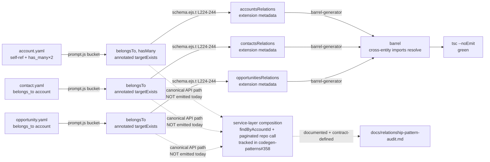

# Relationship pattern: audit + smoke test against crm-domain YAML

## Revision history

- **r1** — plan leaf description.
- **r2** ([comment 4432870852](https://github.com/pattern-stack/dealbrain-integrations/issues/62#issuecomment-4432870852)) — initial spec; correctly mapped the Drizzle template anatomy (4-part: bucketing → targetExists → `relations()` → barrel), but framed Drizzle `relations()` as **the** cross-entity access mechanism. That framing is wrong for this project.
- **r3** ([comment 4433157599](https://github.com/pattern-stack/dealbrain-integrations/issues/62#issuecomment-4433157599)) — reframed cross-entity access around **service-layer composition via FK + repo calls** (core), with Drizzle `relations()` demoted to **opt-in table metadata** for hand-written ad-hoc queries (extension). Left seven open questions unresolved.
- **r4 (this)** — folds maintainer answers into the architecture body. Empirically grepped current templates and confirmed a gap (no service-layer composition methods emitted today for `relationships:` blocks); filed follow-up [codegen-patterns#358](https://github.com/pattern-stack/codegen-patterns/issues/358) to close the gap. Locks the canonical shape (paginated `has_many`, mirrored junction association methods, composed-DTO list return) so `junction-association-codegen` inherits a definite contract. r3 file inventory and smoke fixtures preserved unchanged.

## Goal

Verify that the Relationship pattern (already shipped upstream in commits `8a5bc13`, `ef5e898`, `269ab3f`, `01bb917`) covers what the wave-1 `crm-domain` stack will need, **without re-implementing it**. Three deliverables, all narrowly scoped:

1. **Audit note** in `docs/` that (a) documents the canonical service-layer composition pattern for cross-entity access, (b) enumerates each crm-domain relationship shape and the supporting commit, (c) **names the empirically-confirmed gap** that today's templates do not yet emit service-layer composition methods (only Drizzle `relations()` + an inverse-FK finder on the declaring repo), and (d) maps the Drizzle template anatomy as reference appendix. Audit references the follow-up issue [codegen-patterns#358](https://github.com/pattern-stack/codegen-patterns/issues/358) that will close the gap.
2. **Cross-entity emission documentation** capturing how `junction-association-codegen` (CGP-XX, sibling leaf) will plug into the existing emission layers and the canonical service-composition pattern. The lever it reuses is the **service-method composition pattern**, not Drizzle's `with: { ... }` joins. Because today's templates do not yet emit composition methods on the entity side, junction-association-codegen will be the leaf that introduces the pattern in code — this audit defines the contract it must satisfy (paginated `has_many`, mirrored attach/detach/list/setPrimary methods, composed join-shaped DTO return).
3. **One smoke test** exercising self-ref `belongs_to` + cross-entity `belongs_to`/`has_many` against a crm-domain-shaped fixture set. The smoke asserts that **whatever today's codegen emits** ships correctly — currently the Drizzle `relations()` table-metadata block plus the declaring-side `findBy<FK>Id` finder. Composition-method assertions are explicitly deferred until codegen-patterns#358 lands.

If any further gap is uncovered during the audit, raise a separate issue rather than expanding scope. This issue is verification + contract-definition, not extension.

## Architecture (canonical, post-maintainer-answers)

### The API path — service-layer composition via FK + repo (the **core contract**)

Cross-entity access in generated code goes through **service methods** that compose by calling multiple **single-table repos**. There is no SQL JOIN at this layer. **`has_many` traversal is paginated by default** (maintainer answer Q2):

```typescript
// AccountService.contacts(id) — has_many traversal via inverse FK, paginated.
async contacts(
  accountId: string,
  opts?: { cursor?: string; limit?: number },
): Promise<Contact[]> {
  return this.contactRepo.findByAccountId(accountId, opts);  // one query, one table
}

// OpportunityService.contacts.list(id) — many-to-many via junction, paginated,
// composed join-shaped DTO (maintainer answer Q4).
async list(
  opportunityId: string,
  opts?: { cursor?: string; limit?: number },
): Promise<Array<{ entity: Contact; link: OpportunityContactLink }>> {
  const links = await this.junctionRepo.findByOpportunityId(opportunityId, opts);  // query 1
  const contacts = await this.contactRepo.findManyByIds(links.map(l => l.contactId)); // query 2
  return links.map(link => ({
    entity: contacts.find(c => c.id === link.contactId)!,
    link,
  }));
}

// ContactService.account(contactId) — belongs_to traversal via owning FK, scalar.
async account(contactId: string): Promise<Account | null> {
  const contact = await this.repository.findById(contactId);
  return contact ? this.accountRepo.findById(contact.accountId) : null;
}
```

Two queries, no JOIN. The repos are pure single-table CRUD. The composition lives in the service.

**Naming choices fixed by maintainer answers:**

- **Pagination shape** — `{ cursor?, limit? }`. Cursor-based by default; implementer should grep for existing pagination convention in `queries:`-block emission first and adopt whatever is already in place. If no existing convention exists, this is the canonical shape.
- **List-association DTO outer key** — `entity` (not `target`). Rationale: from a consumer's perspective, the thing they reached for is the **entity** at the other end of the link; "target" reads internally and re-uses a template-pass concept (`targetExists`) for a different purpose. Pairs cleanly with `link` for the junction-row metadata.

### Why — the ElectricSQL-parity rationale

The project replicates tables to the client via ElectricSQL (table-shaped replication, not query-shaped). Joins cannot resolve prior to replication: the client receives `accounts`, `contacts`, `opportunities`, and the junction table as **separate replicated rowsets**, then composes locally.

If the backend composes the same way — service-layer methods calling single-table repos — then **one composition pattern exists across both sides**. Backend `OpportunityService.contacts.list()` and client `OpportunityModel.contacts.list()` have identical shapes, identical query counts, identical pagination semantics, identical edge cases. Pagination, in particular, falls out naturally: cursor-based pagination over a junction-table query has the same shape on backend (Postgres cursor) and client (Electric local-replica cursor).

The alternative — backend uses Drizzle's `db.query.opportunities.findMany({ with: { contacts: true } })` while the client composes locally — forks the code paths *and* the mental model. The client never gets the join; only the backend does. Code review, debugging, and reasoning about query cost all bifurcate.

This is the project's CLAUDE.md **"core contract + opt-in extensions"** principle applied at the access-pattern boundary:

- **Core** — service-layer composition via FK + repo calls. Portable across backend and client. **All generated cross-entity API methods MUST use this.**
- **Extension** — Drizzle's `relations()` + `with: { ... }` query helper. Backend-only. **Useful for hand-written ad-hoc queries that knowingly will not run client-side. Generated code MUST NOT use it.**

The same principle that says "don't pretend all databases are equivalent" (CLAUDE.md) says **don't pretend backend and client are equivalent** by hiding the topology mismatch behind a uniform `with:` interface.

### Drizzle `relations()` — table metadata (the **opt-in extension**)

The current templates emit a `<plural>Relations = relations(<plural>, ({ one, many }) => ({ ... }))` const on each entity's schema file. **Resolution (maintainer answer Q5): keep this emission as-is.** It's free typed metadata that:

- Declares typed bidirectional navigation at the **schema** layer (not the service layer).
- Enables hand-written `db.query.accounts.findMany({ with: { contacts: true } })` for ad-hoc backend queries that knowingly will not replicate (admin tools, reports, migrations, debugging).
- Costs nothing at runtime if unused — it's a typed const, not a query plan.
- Does **not** break ElectricSQL parity. ElectricSQL replicates the underlying tables regardless of what consts the schema file exports; `relations()` is type information for hand-written queries, not a runtime requirement.

**Generated service methods do not use `with:` joins.** They go through the canonical composition path. The `relations()` const is an extension the templates ship for free; consumers who reach past the service layer accept that they're using a backend-specific path.

This is identical to BullMQ-backend exposing Bull Board mounting in CLAUDE.md's example: it's not pretending all backends are equivalent, it's giving consumers the choice to opt into backend-specific capability.

### Junction association placement — mirror both sides (maintainer answer Q3)

For a junction pairing like `opportunity_contact`, association methods are **mirrored on both parent services**, delegating to one shared junction service:

```typescript
// Symmetric API — both sides expose the verb-shape that reads naturally from
// each entity's perspective.
class OpportunityService {
  // ...
  async attachContact(opportunityId: string, contactId: string, link: NewLink): Promise<Link> {
    return this.opportunityContactService.attach(opportunityId, contactId, link);
  }
  contacts = {
    list: (id: string, opts?: PaginationOpts) => this.opportunityContactService.listByOpportunity(id, opts),
    detach: (oppId: string, contactId: string) => this.opportunityContactService.detach(oppId, contactId),
    setPrimary: (oppId: string, contactId: string) => this.opportunityContactService.setPrimary(oppId, contactId),
  };
}

class ContactService {
  // ...
  async addToOpportunity(contactId: string, opportunityId: string, link: NewLink): Promise<Link> {
    return this.opportunityContactService.attach(opportunityId, contactId, link);
  }
  opportunities = {
    list: (id: string, opts?: PaginationOpts) => this.opportunityContactService.listByContact(id, opts),
    detach: (contactId: string, oppId: string) => this.opportunityContactService.detach(oppId, contactId),
    setPrimary: (contactId: string, oppId: string) => this.opportunityContactService.setPrimary(oppId, contactId),
  };
}
```

The maintainer's example wording is preserved structurally — `attachContact` on Opportunity and `addToOpportunity` on Contact — even though the exact verb naming should be picked by the implementer of `junction-association-codegen` to match whatever the rest of the generated surface already does (likely consistent prefix per direction).

**Heuristic for when NOT to mirror** — default is *always mirror*. Skip mirroring only when **both** of these hold:

1. The inverse method would have no natural caller. Example: a junction whose semantics are inherently directional and consumers never start from the "passive" side.
2. The inverse method would require a name that reads as misleading to anyone using it. (Subjective; mirror unless the implementer can name a specific shorter, clearer name and even then prefer mirror.)

In all other cases — including all crm-domain wave-1 pairings — mirror.

### The r2 "Option A vs Option B" question dissolves

The prior spec asked: "Do both halves of a `relationships:` block need to be declared, or should codegen synthesise the inverse?" That question only mattered under the Drizzle-`with:`-centric framing — `db.query.accounts.findMany({ with: { contacts: true } })` requires Drizzle's `relations()` graph to be bidirectional, which requires both halves declared.

Under service-layer composition:

- `AccountService.contacts(id)` is implemented as `this.contactRepo.findByAccountId(id, opts)`. It needs **only the FK column on `contacts`** to exist. The `contact.yaml` `belongs_to: account` declaration is sufficient on the data side.
- The inverse `has_many` declaration on `account.yaml` is needed for two distinct reasons under the canonical pattern: (1) it's what tells codegen to emit `AccountService.contacts(id)` (since the target entity has no idea what other entities point at it without this hint), and (2) it's what makes the Drizzle extension path work bidirectionally.

So the audit's recommendation collapses cleanly: declare both halves. The inverse declaration is no longer just for the extension path — it's also the codegen signal for the inverse service method. `crm-domain/plan.yaml` already declares both halves on `account.yaml` (`relationships.contacts: { type: has_many, ... }` and `relationships.opportunities: { type: has_many, ... }`), so this is moot for wave-1.

The audit doc names the prior Option A/B framing explicitly and explains why it dissolves, so a future reader who finds the r2 comment isn't confused.

### What this means for `junction-association-codegen`

The sibling leaf (CGP-XX) emits typed association methods on the canonical ports of both pairing entities. Because today's templates do not yet emit composition methods (see "Empirical state" below), junction-association-codegen will be the **first leaf to introduce the pattern in emitted code**. The contract it must satisfy:

- **Pagination**: `has_many`-style methods (`.list()` on the junction) take `{ cursor?, limit? }`.
- **Mirroring**: emit on both parent services, delegating to one shared junction service.
- **List return**: composed join-shaped DTO `{ entity: TargetEntity, link: JunctionLink }`. Outer key `entity`.
- **No `with:` joins**: bodies compose two single-table repo calls.

The integration seam in `barrel-generator.ts:189-244` is preserved (junction modules merge into the barrel the same way). What changes is the **shape of methods emitted at the seam**: each association method is a service method whose body is two single-table repo calls.

This is the load-bearing reuse contract between this leaf and `junction-association-codegen`: the canonical association-method pattern is service-layer composition. Junction codegen extends the pattern; it does not invent a parallel one.

## Empirical state — what today's templates actually emit

The audit doc must lead with what's currently in the templates, so a fresh reader sees the gap, not just the target shape. Result of `git grep` across `templates/`:

**On the declaring entity (the side carrying the FK in YAML) — clean architecture only:**

- `templates/entity/new/backend/domain/repository-interface.ejs.t:61-63` — `belongsToRelations.forEach` emits `findBy<FK>Pascal>(id: string, include?: <Class>With): Promise<Class[]>` on the repo interface. The `include?: <Class>With` parameter is **Drizzle-`with:`-extension-path shape leaking into the repo interface** — an anti-pattern under the reframe (audit doc will recommend dropping it in a follow-up issue, but the audit itself does not change templates).
- `templates/entity/new/backend/database/repository.ejs.t:362-380` — implementation of the above.
- `templates/entity/new/backend/database/schema.ejs.t:224-244` — Drizzle `relations()` const (extension-path metadata; keep).
- `templates/entity/new/backend/domain/entity.ejs.t:57-65, 95-103` — optional eager-loaded readonly fields on the domain class (`public readonly contacts?: Contact[]`). Again `with:`-flavored shape.

**On the target entity (the inverse side) — nothing emitted on the service or repo.** No template consumes `hasManyRelations` to emit a service method or a repo method on the target.

**Clean-Lite-PS pipeline — emits a partial `relations()` block, nothing on the service or repo.** `templates/entity/new/clean-lite-ps/{service,repository}.ejs.t` contain zero `relationships`/`belongsTo`/`hasMany` references. The `relations()` const **does** ship from `templates/entity/new/clean-lite-ps/entity.ejs.t:59-69` — but only with `one()` calls for `belongs_to` declarations; the iterator is `clpBelongsTo` (line 62) and never touches `has_many`. So:

- A clean-lite-ps `account.yaml` with `belongs_to: parent_account` + `has_many: contacts` + `has_many: opportunities` emits `accountsRelations = relations(accounts, ({ one }) => ({ parentAccount: one(accounts, { ... }) }))`. The `has_many` declarations are **silently ignored** by the entity template — they produce no Drizzle metadata, no service methods, no repo methods.
- `processBelongsTo` lives at `clean-lite-ps/prompt-extension.js:312-362`; output paths at `:822-829` set entity emission to `${srcRoot}/modules/${plural}/${name}.entity.ts`. There is no `processHasMany` — `grep -n "hasMany\|has_many" clean-lite-ps/prompt-extension.js` returns zero hits.
- `hasRelationsBlock = belongsTo.length > 0` (`prompt-extension.js:820`) — the `relations()` const itself is suppressed when an entity only has `has_many` and no `belongs_to`.

The clean-lite-ps gap is the larger one: even the **table-metadata extension path** is unidirectional (one-side only). The clean pipeline emits bidirectional `relations()` via `schema.ejs.t:224-244` (`one()` for belongsTo/hasOne, `many()` for hasMany); clean-lite-ps does not. Closing this side of the gap is in scope for codegen-patterns#358 (or a sibling issue) but **not** in scope for this audit leaf.

### Resolution — file a follow-up codegen-patterns issue

Filed as **[codegen-patterns#358](https://github.com/pattern-stack/codegen-patterns/issues/358)**: "Emit service-layer composition methods for per-entity `relationships:` block (FK-based, no Drizzle joins)". The issue body cites the four templates above by file:line, names the gap on both pipelines (the clean-lite-ps gap is larger), restates the canonical shape from this audit, and references this spec as the contract reference.

The audit doc references #358 explicitly so future readers see the gap-closure path. **The smoke test in this leaf ships against today's codegen output, not against the post-#358 surface.** Composition-method assertions are deferred until #358 lands.

## Approach

### Audit deliverable shape

Single docs file: `docs/relationship-pattern-audit.md`. Six sections:

1. **Canonical API path (core)** — service-layer composition pattern with the three worked examples above (paginated `has_many`, paginated junction `.list()` with composed DTO, scalar `belongs_to`). Explicit "no SQL JOIN at this layer; two queries; the client does the same composition" framing. Includes the junction-association mirroring pattern with the named heuristic for opting out.
2. **ElectricSQL-parity rationale** — why the architecture is what it is. Cites CLAUDE.md's core-vs-extension principle. One-paragraph summary suitable for a fresh reader.
3. **Empirical state today** — what each pipeline actually emits, by file:line. Names the gap. References the follow-up issue [codegen-patterns#358](https://github.com/pattern-stack/codegen-patterns/issues/358). Notes the maintainer's lean toward `domain/<name>/` layout under clean-lite-ps as a future-reapproach candidate (see Open questions Q7-equivalent below).
4. **Drizzle `relations()` as table metadata (extension)** — documents what the templates emit, what it enables (hand-written ad-hoc queries), the rationale for keeping it (free table metadata, doesn't break Electric replication, gives extension-path code an ergonomic ad-hoc query option), and explicitly: generated service methods do not use `with:` joins.
5. **CRM-domain coverage table** — each row pairs a relationship shape (e.g. "self-ref `belongs_to` on `account.parent_account_id`") to the supporting commit/file/line. Sourced from `dealbrain-integrations/.ai-docs/stacks/crm-domain/plan.yaml`.
6. **Appendix: anatomy of the Drizzle emission layers** — the 4-part Drizzle map (bucketing → targetExists → `relations()` emission → barrel) preserved from r2 as reference for implementers navigating the templates. Demoted from "the architecture" to "the table-metadata implementation".

**Audit doc location** — implementer's choice (maintainer answer to the location question: "don't care"). The spec author's lean remains `docs/relationship-pattern-audit.md` (standalone — the audit verifies an already-merged pattern, not part of an in-flight implementation spec). The issue allows appending to `docs/specs/app-defined-patterns-implementation.md` as an alternative. Note the call in the audit doc so future readers see the rationale even though it's minor.

#### Appendix — anatomy of the Drizzle emission layers (reference)

These four parts are how the templates currently emit table-metadata `relations()` consts. They are accurate; they are not the canonical API path.

| Part | Entry point | What it does |
|---|---|---|
| **Per-entity bucketing pass** | Clean: `templates/entity/new/prompt.js:838-883` partitions into `belongsToRelations` / `hasManyRelations` / `hasOneRelations`. Clean-lite-ps: `templates/entity/new/clean-lite-ps/prompt-extension.js:312-362` (`processBelongsTo`) — there is **no parallel `processHasMany` or `processHasOne`**, so on the clean-lite-ps pipeline only `belongs_to` is bucketed. `prompt-extension.js:820` (`hasRelationsBlock = belongsTo.length > 0`) gates emission of the `relations()` const on whether any `belongs_to` exists. |
| **Target-existence check** | `templates/entity/new/prompt.js:887-912` (`checkEntityExists` + `targetExists` marking) | Each relationship is annotated with whether the **target** entity's `<name>.entity.ts` already exists on disk. Templates use this to suppress imports/methods that would dangle. This is why baseline tests two-pass: pass 1 seeds entity files, pass 2 emits with `targetExists: true`. |
| **Drizzle `relations()` emission** | Clean: `templates/entity/new/backend/database/schema.ejs.t:224-244` — emits `<plural>Relations = relations(<plural>, ({ one, many }) => ({ ... }))`. `belongs_to` → `one(<targetPlural>, { fields: [...], references: [...] })`; `has_many` → `many(<targetPlural>)`; `has_one` → `one(<targetPlural>)`. Bidirectional. Clean-lite-ps: `templates/entity/new/clean-lite-ps/entity.ejs.t:59-69` — emits `<plural>Relations = relations(<plural>, ({ one }) => ({ ... }))`. **Only `belongs_to` is iterated** (`clpBelongsTo` at line 62); `has_many` declarations are dropped. Unidirectional on the FK-bearing side. The clean-lite-ps half-emission is a documented gap (Empirical state above + codegen-patterns#358). |
| **Schema-aware barrel** | `src/cli/shared/barrel-generator.ts:189-244` | Computes module + schema file paths per architecture so cross-entity imports resolve at the right depth (the `01bb917` fix). Junction modules from mechanism (A) merge with regular modules here — this is the integration seam `junction-association-codegen` extends to wire generated junction services into the canonical port surface. |

### Disambiguating the two "Relationship" mechanisms (preserved from r3)

The four cited commits ship **two distinct things** that share the name "relationship". The audit must distinguish them, because `crm-domain` needs only one of them and `junction-association-codegen` will reuse mechanics from both. The lever for downstream reuse is mechanism (B) — and within (B), the **service-method composition pattern**, not the Drizzle const.

- **(A) First-class relationship definitions** — top-level `definitions/relationships/<name>.yaml` parsed by `loadRelationshipFromYaml()` (`src/utils/yaml-loader.ts:1` onward). These produce their own junction entity via the `templates/relationship/new/` Hygen pipeline (entity + repo + service + DTOs + controller + module + use-cases). Shipped by `8a5bc13` (schema/parser/analyzer) and `ef5e898` (templates + CLI). Discovery + barrel inclusion via `collectRelationships()` in `src/cli/shared/barrel-generator.ts:156`. **`crm-domain` does not use this mechanism.**

- **(B) Per-entity `relationships:` block** — `belongs_to`/`has_many`/`has_one` declared inside an entity YAML. Processed by both backend template pipelines: clean in `templates/entity/new/prompt.js:838-927` and clean-lite-ps in `templates/entity/new/clean-lite-ps/prompt-extension.js:302-410, 769-820`. Predates the four cited commits but `269ab3f` fixed a self-ref `belongs_to` bug in clean-lite-ps. **`crm-domain` uses this mechanism for `Account.parent_account_id`, `Contact.account_id`, `Opportunity.account_id`.** This is also the mechanism `junction-association-codegen` extends — specifically the **service-composition** half of what mechanism (B) ships (currently empty, see Empirical state above).

The audit doc names this distinction explicitly so a fresh reader does not lose ninety minutes the same way the r2 author did.

### Smoke test shape (preserved from r3)

A new smoke fixture set (`test/smoke/fixtures/crm/`) plus a `--scenario relationship` flag on `test/smoke/run-smoke.ts`. The harness body is unchanged; the flag swaps `FIXTURES_DIR`. The spec mandates **one harness invocation** so CI cost stays predictable.

Fixtures cover exactly the crm-domain shapes:

- `account.yaml` — self-ref `belongs_to parent_account` on `parent_account_id`. Also declares `relationships.contacts: { type: has_many, target: contact, foreign_key: account_id }` and `relationships.opportunities: { type: has_many, target: opportunity, foreign_key: account_id }` (the inverse `has_many` declarations enable both the extension path AND the post-#358 service-method emission; under today's templates only the extension path is exercised).
- `contact.yaml` — `belongs_to account` on `account_id`.
- `opportunity.yaml` — `belongs_to account` on `account_id`.

Tests pass when:
- `bunx tsc --noEmit` succeeds on the generated project.
- `accounts.entity.ts` contains `parentAccount: one(accounts, ...)` (self-ref relation key derives from FK column per `269ab3f`).
- `accounts.entity.ts` contains the `accountsRelations = relations(accounts, ({ one }) => ({ ... }))` const itself — **and asserts negatively that `many(` does not appear inside that const**. Under clean-lite-ps the entity-template iterator only walks `belongs_to`, so the `has_many: contacts` and `has_many: opportunities` declarations on `account.yaml` are silently dropped. The negative assertion names this gap in the test surface itself (matches Empirical state above); a follow-up smoke iteration after codegen-patterns#358 will flip this to a positive assertion on `contacts: many(contacts)` + `opportunities: many(opportunities)` once clean-lite-ps's entity template iterates `hasMany`.
- `contacts.entity.ts` contains `account: one(accounts, { fields: [contacts.accountId], references: [accounts.id] })`.
- `opportunities.entity.ts` contains the analogous `account: one(accounts, ...)`.

These assertions verify the **clean-lite-ps extension-path table-metadata that the templates actually ship today** — the `belongs_to`-only half of `relations()`. The smoke does **not** assert the service-composition surface — that surface does not exist in today's templates (see Empirical state). Once [codegen-patterns#358](https://github.com/pattern-stack/codegen-patterns/issues/358) lands, follow-up smoke assertions should (a) flip the `many(` negative assertion to a positive one and (b) add service-composition assertions (e.g. grep that `AccountService` has a `contacts(accountId, opts?)` method).

No DB push, no Postgres dependency — schema correctness via TS compile + targeted grep is sufficient for this smoke.



## File-level plan

### Create

- `docs/relationship-pattern-audit.md` — sections 1-6 per above. Leads with the canonical service-layer composition architecture; empirical-state section names the gap and references `codegen-patterns#358`; Drizzle anatomy is appendix. ~400-550 lines. Cites every claim with `<file>:<line>`.
- `test/smoke/fixtures/crm/account.yaml` — self-ref `belongs_to` + two `has_many` (contacts, opportunities). Pattern: `Synced`.
- `test/smoke/fixtures/crm/contact.yaml` — `belongs_to account`. No junction declarations (sibling leaves cover those).
- `test/smoke/fixtures/crm/opportunity.yaml` — `belongs_to account`. Minimal extra fields (`name`, `amount`, `stage` enum) so DTO emission is exercised non-trivially.

### Modify

- `test/smoke/run-smoke.ts` — add a `--scenario` flag (default `default`, accept `relationship`) that swaps `FIXTURES_DIR` between `test/smoke/fixtures/` and `test/smoke/fixtures/crm/`. Roughly +20 lines. **Do not** fork a second runner — every line of smoke-harness drift is a future maintenance tax.
- `justfile` — add `test-smoke-relationship` recipe that invokes `bun test/smoke/run-smoke.ts --scenario relationship`. Wire it into `test-all` so CI runs both scenarios. ~3 lines added.
- `.github/workflows/ci.yml` — no change if `test-all` is the CI entry point (`just test-all` already covers it). Validator confirms.

### Explicitly **not** modified

- `templates/entity/new/prompt.js`, `backend/database/schema.ejs.t`, `backend/domain/repository-interface.ejs.t`, `backend/database/repository.ejs.t`, `backend/application/**`, `clean-lite-ps/service.ejs.t`, `relationship/new/**`, `src/parser/`, `src/analyzer/`, `src/schema/relationship-definition.schema.ts`, `src/utils/yaml-loader.ts`, `src/cli/commands/relationship.ts`, `src/cli/shared/barrel-generator.ts` — this is verification + contract-definition, not template extension. Gap-closure is owned by [codegen-patterns#358](https://github.com/pattern-stack/codegen-patterns/issues/358).

### In-scope template fix (discovered during implementation)

`templates/entity/new/clean-lite-ps/{prompt-extension.js, entity.ejs.t}` — narrow self-ref typecheck fix discovered when the smoke first ran. Self-referential `belongs_to` on clean-lite-ps emits `.references(() => accounts.id, ...)`, which fails TS strict-mode typecheck with TS7022/TS7024 (circular initializer). Fix: gate on `belongsTo.some(r => r.isSelfFk)` and annotate the callback as `(): AnyPgColumn => accounts.id`, plus a type-only import of `AnyPgColumn` from `drizzle-orm/pg-core`. Non-self-FK output is byte-identical. Documented in the audit doc under "Bug shipped in this PR". The bug pre-dated this PR (it existed at fe7b9c8, the cgp-62 r4 spec commit); baseline tests don't run `tsc` so it was never caught. Spec discipline normally says "raise a separate issue for gaps" — the deviation is justified per CLAUDE.md's "specs are living documentation" rule: the smoke can't ship green without the fix.

## Interfaces

No new TypeScript interfaces. The deliverable is **prose + fixtures + one CLI flag**. The flag's shape:

```typescript
// test/smoke/run-smoke.ts — additions near top of file, parsed before tmp-dir creation.

type Scenario = 'default' | 'relationship';

const SCENARIO: Scenario = (() => {
  const idx = process.argv.indexOf('--scenario');
  if (idx === -1) return 'default';
  const value = process.argv[idx + 1];
  if (value !== 'default' && value !== 'relationship') {
    console.error(`Unknown --scenario: ${value}. Expected 'default' or 'relationship'.`);
    process.exit(2);
  }
  return value;
})();

const FIXTURES_DIR = SCENARIO === 'relationship'
  ? path.join(REPO_ROOT, 'test', 'smoke', 'fixtures', 'crm')
  : path.join(REPO_ROOT, 'test', 'smoke', 'fixtures');
```

Assertion helpers added near the end of `runSmoke()`:

```typescript
// Only runs under --scenario relationship. The existing scenario keeps its
// single existing assertion (tsc --noEmit succeeds).
function assertRelationshipEmission(generatedSrc: string): void {
  const reads = (p: string): string =>
    fs.readFileSync(path.join(generatedSrc, p), 'utf8');

  // Path layout — today's clean-lite-ps emits at
  // `src/modules/<plural>/<name>.entity.ts` per the output paths in
  // clean-lite-ps/prompt-extension.js:822-829. The smoke project's
  // `generatedSrc` resolves to `<tmpDir>/src`.

  const accountSchema = reads('modules/accounts/account.entity.ts');
  // Self-ref belongs_to (regression of 269ab3f — `parent_account_id` →
  // `parentAccount`, distinct from the table's own snake_case identifier).
  assertContains(accountSchema, /parentAccount:\s*one\(accounts,/);
  // The `relations()` const ships on the belongs_to side.
  assertContains(accountSchema, /export const accountsRelations\s*=\s*relations\(accounts/);
  // **Negative assertion — names the empirical gap in the test surface.**
  // Clean-lite-ps's entity template iterates `clpBelongsTo` only (entity.ejs.t:62);
  // `has_many` declarations on `account.yaml` are silently dropped. When
  // codegen-patterns#358 lands and the iterator adds `hasMany`, flip this to
  // a positive assertion on `contacts: many(contacts)` + `opportunities: many(...)`.
  assertNotContains(accountSchema, /\bmany\(/);

  const contactSchema = reads('modules/contacts/contact.entity.ts');
  assertContains(
    contactSchema,
    /account:\s*one\(accounts,\s*\{[\s\S]*fields:\s*\[contacts\.accountId\]/,
  );

  const oppSchema = reads('modules/opportunities/opportunity.entity.ts');
  assertContains(
    oppSchema,
    /account:\s*one\(accounts,\s*\{[\s\S]*fields:\s*\[opportunities\.accountId\]/,
  );
}

function assertContains(haystack: string, needle: RegExp): void {
  if (!needle.test(haystack)) {
    throw new Error(
      `Smoke assertion failed: expected to find ${needle} in generated output.`,
    );
  }
}

function assertNotContains(haystack: string, needle: RegExp): void {
  if (needle.test(haystack)) {
    throw new Error(
      `Smoke assertion failed: did not expect to find ${needle} in generated output (gap-naming negative assertion).`,
    );
  }
}
```

Path layout under `generatedSrc` is `<tmpDir>/src` (per `clean-lite-ps/prompt-extension.js:822-829`). Entity files live at `modules/<plural>/<name>.entity.ts` under that root. Assertion regexes are shape-correct regardless of path.

## Tests

The smoke test **is** the test. Coverage matrix:

| Shape | Where it lives | How asserted |
|---|---|---|
| Self-ref `belongs_to` (regression of `269ab3f`) | `account.yaml.relationships.parent_account` | `assertRelationshipEmission` regex on `parentAccount: one(accounts, ...)`. Also implicitly: `tsc --noEmit` would fail with TS2300 if the `269ab3f` fix regressed (duplicate `accounts` import). |
| Cross-entity `belongs_to` | `contact.yaml`, `opportunity.yaml` | Regex on `account: one(accounts, { fields: [...accountId], references: [...id] })` in both schema files. |
| Inverse `has_many` (extension-path metadata, clean-lite-ps emit gap) | `account.yaml.relationships.{contacts,opportunities}` | **Negative** regex (`assertNotContains(/\bmany\(/)`) in `account.entity.ts`. Names the gap that clean-lite-ps's entity template only iterates `belongs_to`. Pivots to a positive assertion (`contacts: many(...)` + `opportunities: many(...)`) when codegen-patterns#358 closes the gap. |
| `relations()` const presence (clean-lite-ps belongs_to side) | All three fixtures (each has a `belongs_to`) | Regex on `export const <plural>Relations = relations(<plural>` in each entity file. Verifies the emission gate (`hasRelationsBlock = belongsTo.length > 0`) fires correctly. |
| Barrel-import-depth (regression of `01bb917`) | All three fixtures | `bunx tsc --noEmit` succeeds. Module-resolution failure at the wrong import depth would emit TS2307. |
| Service-layer composition surface | (deferred to codegen-patterns#358) | Not asserted in this leaf. The canonical API path is documented in the audit; today's templates do not emit it. Follow-up smoke assertions live with #358. |
| Audit doc accuracy | `docs/relationship-pattern-audit.md` | Manually verified during human Gate-1 review. |

CI wiring: `just test-all` calls `test-smoke` (existing) + `test-smoke-relationship` (new). Total added CI time: ~60-120s. The existing `test-smoke` is preserved untouched.

Unit tests are **not** added. The schema/parser/analyzer paths for first-class relationships have 48+ tests landed in `8a5bc13`. The per-entity `relationships:` block is exercised by `test-baseline`.

## Out of scope

- Any change to template logic, parser, analyzer, or schema. Verification + contract-definition only.
- Closing the service-composition gap. That work is owned by [codegen-patterns#358](https://github.com/pattern-stack/codegen-patterns/issues/358).
- Inverse-relation synthesis (auto-emit `has_many` from a declared `belongs_to`). Under the reframe, declaring both halves is required anyway (signals codegen to emit the inverse service method post-#358); no synthesis needed.
- Junction pattern work — entirely owned by sibling leaves (`junction-pattern-definition`, `junction-hygen-templates`, `junction-association-codegen`, `junction-test-fixtures`). This audit defines the contract `junction-association-codegen` must satisfy (paginated, mirrored, composed-DTO list return).
- Stripping `relations()` emission from the templates. Resolved: keep as opt-in extension metadata (maintainer answer Q5).
- Dropping the `include?: <Class>With` parameter from repo interfaces. Recommended in the audit (it's extension-path shape leaking into the core contract); execution is part of #358 or its own follow-up.
- Postgres integration test for relationship FK constraints. The smoke test verifies *codegen output*; FK enforcement is a Drizzle/Postgres responsibility tested by `test-family` (already green).
- `user_integration` from `crm-domain/plan.yaml` — has no relationships in scope; outside this leaf.
- Account_contact / opportunity_contact junctions — Junction pattern, not Relationship. Sibling leaves cover them.
- Changing the on-disk layout under clean-lite-ps. Maintainer lean is toward `domain/<name>/<name>.entity.ts` over today's `src/modules/<plural>/<name>.entity.ts`, noted in the audit's Empirical-state section as a future-reapproach candidate. Not changed in this leaf.

## Open questions

All r3 open questions are resolved. Resolutions baked into the spec body above:

- **Q1 (does today's codegen emit service-layer composition methods?)** → No. Empirically confirmed via grep of `templates/`. Filed [codegen-patterns#358](https://github.com/pattern-stack/codegen-patterns/issues/358) to close the gap. Audit doc leads with the empirical state.
- **Q2 (has_many traversal shape)** → Paginated by default. `{ cursor?, limit? }` opts param. Worked examples updated.
- **Q3 (junction association placement)** → Mirror both sides. Heuristic for opting out named.
- **Q4 (list-association return shape)** → Composed join-shaped DTO `{ entity, link }`. Outer key chosen as `entity`.
- **Q5 (keep or strip `relations()`)** → Keep as opt-in extension metadata. Rationale documented.
- **Q6 (audit doc location)** → Implementer's choice; spec author leans toward standalone `docs/relationship-pattern-audit.md`.
- **Q7 (smoke project on-disk layout under clean-lite-ps)** → Match existing `verifyTypecheck()` convention (today: `src/modules/<plural>/...`). Audit notes maintainer's lean toward `domain/<name>/...` as a future-reapproach candidate.

### Questions dropped from r2

- **Whether an inverse-synthesis pass exists** — preserved as a low-stakes implementation detail in the audit appendix; under the reframe its answer doesn't change the architecture. (It only affects whether the extension path "just works" or requires both halves declared.)
- **Option A vs Option B remediation framing** — dissolved. See "The r2 Option A/B question dissolves" above. Audit doc names the prior framing and the resolution so the r2/r3 comments aren't confusing artifacts.
