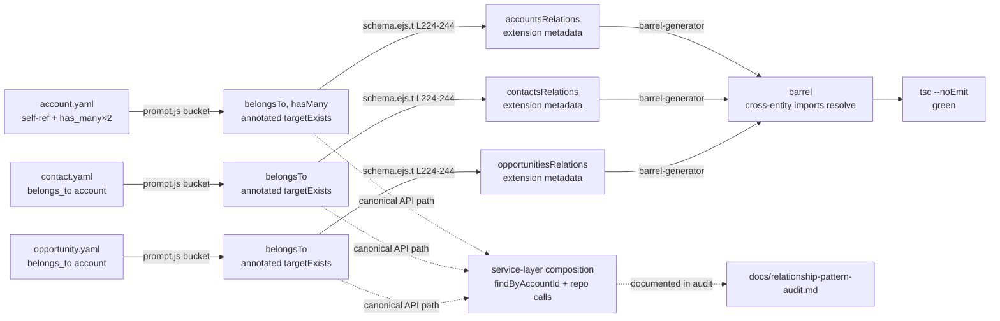

# Relationship pattern: audit + smoke test against crm-domain YAML

## Revision history

- **r1** — plan leaf description.
- **r2** ([comment 4432870852](https://github.com/pattern-stack/dealbrain-integrations/issues/62#issuecomment-4432870852)) — initial spec; correctly mapped the Drizzle template anatomy (4-part: bucketing → targetExists → `relations()` → barrel), but framed Drizzle `relations()` as **the** cross-entity access mechanism. That framing is wrong for this project.
- **r3 (this)** — reframes cross-entity access around **service-layer composition via FK + repo calls** (core), with Drizzle `relations()` demoted to **opt-in table metadata** for hand-written ad-hoc queries (extension). The file inventory, smoke fixtures, smoke assertions, and 4-part Drizzle technical map are **preserved unchanged** as reference material — only the architectural narrative changes.

## Goal

Verify that the Relationship pattern (already shipped upstream in commits `8a5bc13`, `ef5e898`, `269ab3f`, `01bb917`) covers what the wave-1 `crm-domain` stack will need, **without re-implementing it**. Three deliverables, all narrowly scoped:

1. **Audit note** in `docs/` that (a) documents the canonical service-layer composition pattern for cross-entity access, (b) enumerates each crm-domain relationship shape and the supporting commit, and (c) maps the Drizzle template anatomy as reference appendix.
2. **Cross-entity emission documentation** capturing how `junction-association-codegen` (CGP-XX, sibling leaf) will plug into the existing emission layers and the canonical service-composition pattern. The lever it reuses is the **service-method composition pattern**, not Drizzle's `with: { ... }` joins.
3. **One smoke test** exercising self-ref `belongs_to` + cross-entity `belongs_to`/`has_many` against a crm-domain-shaped fixture set. The smoke asserts that `relations()` table-metadata still ships (so hand-written ad-hoc queries can use it) and that the generated service surfaces the composition methods.

If any gap is uncovered during the audit, **raise a separate issue** rather than expanding scope. This issue is verification, not extension.

## Architecture (the reframe)

### The API path — service-layer composition via FK + repo (the **core contract**)

Cross-entity access in generated code goes through **service methods** that compose by calling multiple **single-table repos**. There is no SQL JOIN at this layer.

```typescript
// AccountService.contacts(accountId) — has_many traversal via inverse FK.
async contacts(accountId: string): Promise<Contact[]> {
  return this.contactRepo.findByAccountId(accountId);  // one query, one table
}

// OpportunityService.contacts.list(opportunityId) — many-to-many via junction.
async list(opportunityId: string): Promise<Contact[]> {
  const links = await this.junctionRepo.findByOpportunityId(opportunityId);  // query 1
  return this.contactRepo.findManyByIds(links.map(l => l.contactId));        // query 2
}

// ContactService.account(contactId) — belongs_to traversal via owning FK.
async account(contactId: string): Promise<Account | null> {
  const contact = await this.contactRepo.findById(contactId);
  return contact ? this.accountRepo.findById(contact.accountId) : null;
}
```

Two queries, no JOIN. The repos are pure single-table CRUD. The composition lives in the service.

### Why — the ElectricSQL-parity rationale

The project replicates tables to the client via ElectricSQL (table-shaped replication, not query-shaped). Joins cannot resolve prior to replication: the client receives `accounts`, `contacts`, `opportunities`, and the junction table as **separate replicated rowsets**, then composes locally.

If the backend composes the same way — service-layer methods calling single-table repos — then **one composition pattern exists across both sides**. Backend `OpportunityService.contacts.list()` and client `OpportunityModel.contacts.list()` have identical shapes, identical query counts, identical pagination semantics, identical edge cases.

The alternative — backend uses Drizzle's `db.query.opportunities.findMany({ with: { contacts: true } })` while the client composes locally — forks the code paths *and* the mental model. The client never gets the join; only the backend does. Code review, debugging, and reasoning about query cost all bifurcate.

This is the project's CLAUDE.md **"core contract + opt-in extensions"** principle applied at the access-pattern boundary:

- **Core** — service-layer composition via FK + repo calls. Portable across backend and client. **All generated cross-entity API methods MUST use this.**
- **Extension** — Drizzle's `relations()` + `with: { ... }` query helper. Backend-only. **Useful for hand-written ad-hoc queries that knowingly will not run client-side. Generated code MUST NOT use it.**

The same principle that says "don't pretend all databases are equivalent" (CLAUDE.md) says **don't pretend backend and client are equivalent** by hiding the topology mismatch behind a uniform `with:` interface.

### Drizzle `relations()` — table metadata (the **opt-in extension**)

The current templates emit a `<plural>Relations = relations(<plural>, ({ one, many }) => ({ ... }))` const on each entity's schema file. This is real and useful:

- It declares typed bidirectional navigation at the **schema** layer (not the service layer).
- It enables hand-written `db.query.accounts.findMany({ with: { contacts: true } })` for ad-hoc backend queries that knowingly will not replicate (admin tools, reports, migrations, debugging).
- It costs nothing at runtime if unused — it's a typed const, not a query plan.

**Generated service methods do not use `with:` joins.** They go through the canonical composition path. The `relations()` const is an extension the templates ship for free; consumers who reach past the service layer accept that they're using a backend-specific path.

This is identical to BullMQ-backend exposing Bull Board mounting in CLAUDE.md's example: it's not pretending all backends are equivalent, it's giving consumers the choice to opt into backend-specific capability.

### What this means for `junction-association-codegen`

The sibling leaf (CGP-XX) emits typed association methods on canonical ports (`OpportunityPort.contacts.{attach,detach,list,setPrimary}`, mirrored on `ContactPort`). Under the r2 framing those methods would be Drizzle-`with:`-shaped; under r3 they are **service methods that compose `junctionRepo` + `entityRepo` calls**.

The integration seam in `barrel-generator.ts:189-244` is preserved (junction modules merge into the barrel the same way). What changes is the **shape of methods emitted at the seam**: each association method is a service method whose body is two single-table repo calls.

This is the load-bearing reuse contract between this leaf and `junction-association-codegen`: the canonical association-method pattern is service-layer composition. Junction codegen extends the pattern; it does not invent a parallel one.

### The r2 "Option A vs Option B" question dissolves

The prior spec asked: "Do both halves of a `relationships:` block need to be declared, or should codegen synthesise the inverse?" That question only mattered under the Drizzle-`with:`-centric framing — `db.query.accounts.findMany({ with: { contacts: true } })` requires Drizzle's `relations()` graph to be bidirectional, which requires both halves declared.

Under service-layer composition:

- `AccountService.contacts(id)` is implemented as `this.contactRepo.findByAccountId(id)`. It needs **only the FK column on `contacts`** to exist. The `contact.yaml` `belongs_to: account` declaration is sufficient.
- The inverse `has_many` declaration on `account.yaml` is needed only if the consumer wants the typed-`with:` navigation in `relations()` — i.e. only if they reach into the extension.

So the audit's recommendation collapses: declare both halves **if** you want the Drizzle extension path to work; declare only the owning side **if** you only need the canonical service-layer path. `crm-domain/plan.yaml` already declares both halves on `account.yaml` (`relationships.contacts: { type: has_many, ... }`), so this is moot for wave-1.

The audit doc names the prior Option A/B framing explicitly and explains why it dissolves, so a future reader who finds the r2 comment isn't confused.

## Approach

### Audit deliverable shape

Single docs file: `docs/relationship-pattern-audit.md`. Five sections:

1. **The API path (core)** — service-layer composition pattern with worked examples drawn from crm-domain (the three shown above plus a junction example once `opportunity_contact` is in scope). Explicit "no SQL JOIN at this layer; two queries; the client does the same composition" framing.
2. **ElectricSQL-parity rationale** — why the architecture is what it is. Cites CLAUDE.md's core-vs-extension principle. One-paragraph summary suitable for a fresh reader.
3. **Drizzle `relations()` as table metadata (extension)** — documents what the templates emit, what it enables (hand-written ad-hoc queries), and explicitly: generated service methods do not use `with:` joins.
4. **CRM-domain coverage table** — each row pairs a relationship shape (e.g. "self-ref `belongs_to` on `account.parent_account_id`") to the supporting commit/file/line. Sourced from `dealbrain-integrations/.ai-docs/stacks/crm-domain/plan.yaml`.
5. **Appendix: anatomy of what ships today** — the 4-part Drizzle map (bucketing → targetExists → `relations()` emission → barrel) preserved from r2 as reference for implementers navigating the templates. Demoted from "the architecture" to "the table-metadata implementation".

#### Appendix — anatomy of the Drizzle emission layers (reference)

These four parts are how the templates currently emit table-metadata `relations()` consts. They are accurate; they are not the canonical API path.

| Part | Entry point | What it does |
|---|---|---|
| **Per-entity bucketing pass** | `templates/entity/new/prompt.js:838-883` (and the parallel pass at `templates/entity/new/clean-lite-ps/prompt-extension.js:769-787`) | Reads `entity.relationships`, partitions into `belongsToRelations` / `hasManyRelations` / `hasOneRelations`, derives Pascal/plural/foreign-key permutations once and reuses across templates. |
| **Target-existence check** | `templates/entity/new/prompt.js:887-912` (`checkEntityExists` + `targetExists` marking) | Each relationship is annotated with whether the **target** entity's `<name>.entity.ts` already exists on disk. Templates use this to suppress imports/methods that would dangle. This is why baseline tests two-pass: pass 1 seeds entity files, pass 2 emits with `targetExists: true`. |
| **Drizzle `relations()` emission** | `templates/entity/new/backend/database/schema.ejs.t:224-244` | Emits a single `<plural>Relations = relations(<plural>, ({ one, many }) => ({ ... }))` block on the declaring entity's schema file. `belongs_to` emits `one(<targetPlural>, { fields: [...], references: [...] })`; `has_many` emits `many(<targetPlural>)`; `has_one` emits `one(<targetPlural>)`. Enables hand-written `db.query.X.findMany({ with: { Y: true } })` *only if* both sides declared. |
| **Schema-aware barrel** | `src/cli/shared/barrel-generator.ts:189-244` | Computes module + schema file paths per architecture so cross-entity imports resolve at the right depth (the `01bb917` fix). Junction modules from mechanism (A) merge with regular modules here — this is the integration seam `junction-association-codegen` extends to wire generated junction services into the canonical port surface. |

### Disambiguating the two "Relationship" mechanisms (preserved from r2)

The four cited commits ship **two distinct things** that share the name "relationship". The audit must distinguish them, because `crm-domain` needs only one of them and `junction-association-codegen` will reuse mechanics from both. The lever for downstream reuse is mechanism (B) — and within (B), the **service-method composition pattern**, not the Drizzle const.

- **(A) First-class relationship definitions** — top-level `definitions/relationships/<name>.yaml` parsed by `loadRelationshipFromYaml()` (`src/utils/yaml-loader.ts:1` onward). These produce their own junction entity via the `templates/relationship/new/` Hygen pipeline (entity + repo + service + DTOs + controller + module + use-cases). Shipped by `8a5bc13` (schema/parser/analyzer) and `ef5e898` (templates + CLI). Discovery + barrel inclusion via `collectRelationships()` in `src/cli/shared/barrel-generator.ts:156`. **`crm-domain` does not use this mechanism.**

- **(B) Per-entity `relationships:` block** — `belongs_to`/`has_many`/`has_one` declared inside an entity YAML. Processed by both backend template pipelines: clean in `templates/entity/new/prompt.js:838-927` and clean-lite-ps in `templates/entity/new/clean-lite-ps/prompt-extension.js:302-410, 769-820`. Predates the four cited commits but `269ab3f` fixed a self-ref `belongs_to` bug in clean-lite-ps. **`crm-domain` uses this mechanism for `Account.parent_account_id`, `Contact.account_id`, `Opportunity.account_id`.** This is also the mechanism `junction-association-codegen` extends — specifically the **service-composition** half of what mechanism (B) ships.

The audit doc names this distinction explicitly so a fresh reader does not lose ninety minutes the same way the r2 author did.

### Smoke test shape (preserved from r2)

A new smoke fixture set (`test/smoke/fixtures/crm/`) plus a `--scenario relationship` flag on `test/smoke/run-smoke.ts`. The harness body is unchanged; the flag swaps `FIXTURES_DIR`. The spec mandates **one harness invocation** so CI cost stays predictable.

Fixtures cover exactly the crm-domain shapes:

- `account.yaml` — self-ref `belongs_to parent_account` on `parent_account_id`. Also declares `relationships.contacts: { type: has_many, target: contact, foreign_key: account_id }` and `relationships.opportunities: { type: has_many, target: opportunity, foreign_key: account_id }` (the inverse `has_many` declarations enable the extension path; they are not required for the core path).
- `contact.yaml` — `belongs_to account` on `account_id`.
- `opportunity.yaml` — `belongs_to account` on `account_id`.

Tests pass when:
- `bunx tsc --noEmit` succeeds on the generated project.
- `accounts.entity.ts` contains `parentAccount: one(accounts, ...)` (self-ref relation key derives from FK column per `269ab3f`).
- `accounts.entity.ts` contains `contacts: many(contacts)` and `opportunities: many(opportunities)`.
- `contacts.entity.ts` contains `account: one(accounts, { fields: [contacts.accountId], references: [accounts.id] })`.
- `opportunities.entity.ts` contains the analogous `account: one(accounts, ...)`.

These assertions verify the **extension path table-metadata still ships**. The smoke does not currently assert the service-composition surface (see Open questions — that's a junction-association-codegen concern, since per-entity `relationships:` may not emit service-layer composition methods today; templates emit only the Drizzle const).

No DB push, no Postgres dependency — schema correctness via TS compile + targeted grep is sufficient for this smoke.



## File-level plan

### Create

- `docs/relationship-pattern-audit.md` — sections 1-5 per above. Leads with the service-layer composition architecture; Drizzle anatomy is appendix. ~350-500 lines (longer than r2 because of the architecture sections; the Drizzle-anatomy content is unchanged, just relocated). Cites every claim with `<file>:<line>`.
- `test/smoke/fixtures/crm/account.yaml` — self-ref `belongs_to` + two `has_many` (contacts, opportunities). Pattern: `Synced`.
- `test/smoke/fixtures/crm/contact.yaml` — `belongs_to account`. No junction declarations (sibling leaves cover those).
- `test/smoke/fixtures/crm/opportunity.yaml` — `belongs_to account`. Minimal extra fields (`name`, `amount`, `stage` enum) so DTO emission is exercised non-trivially.

### Modify

- `test/smoke/run-smoke.ts` — add a `--scenario` flag (default `default`, accept `relationship`) that swaps `FIXTURES_DIR` between `test/smoke/fixtures/` and `test/smoke/fixtures/crm/`. Roughly +20 lines. **Do not** fork a second runner — every line of smoke-harness drift is a future maintenance tax.
- `justfile` — add `test-smoke-relationship` recipe that invokes `bun test/smoke/run-smoke.ts --scenario relationship`. Wire it into `test-all` so CI runs both scenarios. ~3 lines added.
- `.github/workflows/ci.yml` — no change if `test-all` is the CI entry point (`just test-all` already covers it). Validator confirms.

### Explicitly **not** modified

- `templates/entity/new/prompt.js`, `clean-lite-ps/prompt-extension.js`, `backend/database/schema.ejs.t`, `relationship/new/**`, `src/parser/`, `src/analyzer/`, `src/schema/relationship-definition.schema.ts`, `src/utils/yaml-loader.ts`, `src/cli/commands/relationship.ts`, `src/cli/shared/barrel-generator.ts` — this is verification, not extension. If the audit finds a gap, file a separate issue.

## Interfaces

No new TypeScript interfaces. The deliverable is **prose + fixtures + one CLI flag**. The flag's shape:

```typescript
// test/smoke/run-smoke.ts — additions near top of file, parsed before tmp-dir creation.

type Scenario = 'default' | 'relationship';

const SCENARIO: Scenario = (() => {
  const idx = process.argv.indexOf('--scenario');
  if (idx === -1) return 'default';
  const value = process.argv[idx + 1];
  if (value !== 'default' && value !== 'relationship') {
    console.error(`Unknown --scenario: ${value}. Expected 'default' or 'relationship'.`);
    process.exit(2);
  }
  return value;
})();

const FIXTURES_DIR = SCENARIO === 'relationship'
  ? path.join(REPO_ROOT, 'test', 'smoke', 'fixtures', 'crm')
  : path.join(REPO_ROOT, 'test', 'smoke', 'fixtures');
```

Assertion helpers added near the end of `runSmoke()`:

```typescript
// Only runs under --scenario relationship. The existing scenario keeps its
// single existing assertion (tsc --noEmit succeeds).
function assertRelationshipEmission(generatedSrc: string): void {
  const reads = (p: string): string => fs.readFileSync(path.join(generatedSrc, p), 'utf8');

  const accountSchema = reads('domain/account/account.entity.ts'); // path per clean-lite-ps layout
  assertContains(accountSchema, /parentAccount:\s*one\(accounts,/);
  assertContains(accountSchema, /contacts:\s*many\(contacts\)/);
  assertContains(accountSchema, /opportunities:\s*many\(opportunities\)/);

  const contactSchema = reads('domain/contact/contact.entity.ts');
  assertContains(contactSchema, /account:\s*one\(accounts,\s*\{[\s\S]*fields:\s*\[contacts\.accountId\]/);

  const oppSchema = reads('domain/opportunity/opportunity.entity.ts');
  assertContains(oppSchema, /account:\s*one\(accounts,\s*\{[\s\S]*fields:\s*\[opportunities\.accountId\]/);
}

function assertContains(haystack: string, needle: RegExp): void {
  if (!needle.test(haystack)) {
    throw new Error(`Smoke assertion failed: expected to find ${needle} in generated output.`);
  }
}
```

Path layout under `generatedSrc` is whatever the existing smoke harness already uses for the default scenario — the implementer reads the same path the default scenario reads (do **not** hardcode; mirror existing `verifyTypecheck()` conventions in `run-smoke.ts`).

## Tests

The smoke test **is** the test. Coverage matrix:

| Shape | Where it lives | How asserted |
|---|---|---|
| Self-ref `belongs_to` (regression of `269ab3f`) | `account.yaml.relationships.parent_account` | `assertRelationshipEmission` regex on `parentAccount: one(accounts, ...)`. Also implicitly: `tsc --noEmit` would fail with TS2300 if the `269ab3f` fix regressed (duplicate `accounts` import). |
| Cross-entity `belongs_to` | `contact.yaml`, `opportunity.yaml` | Regex on `account: one(accounts, { fields: [...accountId], references: [...id] })` in both schema files. |
| Inverse `has_many` (extension-path metadata) | `account.yaml.relationships.{contacts,opportunities}` | Regex on `contacts: many(contacts)` and `opportunities: many(opportunities)` in `account.entity.ts`. Verifies the extension path table-metadata still ships. |
| Barrel-import-depth (regression of `01bb917`) | All three fixtures | `bunx tsc --noEmit` succeeds. Module-resolution failure at the wrong import depth would emit TS2307. |
| Service-layer composition surface | (deferred) | Not asserted in this leaf — see Open questions. The canonical API path is documented in the audit; whether today's templates emit service methods for per-entity `relationships:` blocks is one of the questions this audit answers. |
| Audit doc accuracy | `docs/relationship-pattern-audit.md` | Manually verified during human Gate-1 review. |

CI wiring: `just test-all` calls `test-smoke` (existing) + `test-smoke-relationship` (new). Total added CI time: ~60-120s. The existing `test-smoke` is preserved untouched.

Unit tests are **not** added. The schema/parser/analyzer paths for first-class relationships have 48+ tests landed in `8a5bc13`. The per-entity `relationships:` block is exercised by `test-baseline`.

## Out of scope

- Any change to template logic, parser, analyzer, or schema. Verification-only.
- Inverse-relation synthesis (auto-emit `has_many` from a declared `belongs_to`). Under the reframe this is a low-stakes extension-path-only concern; if anyone wants it, separate issue.
- Junction pattern work — entirely owned by sibling leaves (`junction-pattern-definition`, `junction-hygen-templates`, `junction-association-codegen`, `junction-test-fixtures`).
- Stripping `relations()` emission from the templates. Out of scope. The audit's recommendation (see Open questions) is to **keep** it as opt-in extension metadata.
- Postgres integration test for relationship FK constraints. The smoke test verifies *codegen output*; FK enforcement is a Drizzle/Postgres responsibility tested by `test-family` (already green).
- `user_integration` from `crm-domain/plan.yaml` — has no relationships in scope; outside this leaf.
- Account_contact / opportunity_contact junctions — Junction pattern, not Relationship. Sibling leaves cover them.

## Open questions

1. **Does today's per-entity-`relationships:` codegen emit service-layer composition methods, or only the Drizzle `relations()` const?** The reframe makes this the load-bearing question for the leaf. Answer it in the audit by `git grep` on the templates:
   - If templates already emit `AccountService.contacts(id)` style methods that call `contactRepo.findByAccountId(id)` — document the shape, declare it the canonical pattern, point `junction-association-codegen` at it.
   - If templates emit only the Drizzle const — name the gap explicitly. `junction-association-codegen` will be the leaf that adds the service-composition layer; this audit's role is to confirm the gap and define the contract (method shape, return type, pagination policy) downstream codegen will fill.
   - Either way, the audit doc must answer this with file:line citations, not speculation.
2. **What shape do service-layer composition methods take for `has_many` traversal?** Three plausible shapes:
   - **List (eager)** — `accountService.contacts(id): Promise<Contact[]>`. Simplest; matches the worked examples above. Risk: unbounded result on hot rows.
   - **Paginated** — `accountService.contacts(id, { limit, offset }): Promise<Contact[]>`. Safer default; requires the repo to support pagination.
   - **Lazy** — `accountService.contacts(id): { list, count, page }`. Most flexible; heaviest API surface.
   This is a junction-association-codegen design choice. The audit doc should name the options and recommend one (lean toward paginated — matches client-side ElectricSQL composition more naturally).
3. **For junction services specifically: do association methods (`attach`, `detach`, `list`, `setPrimary`) live on the parent service, the junction service, or both?** Three patterns:
   - Methods on the parent service only — `OpportunityService.contacts.attach(opportunityId, contactId, metadata)`. Hides the junction.
   - Methods on the junction service only — `OpportunityContactService.attach(...)`. Surfaces the junction.
   - Mirror on both sides — `OpportunityService.contacts.attach()` AND `ContactService.opportunities.attach()`, both delegating to a single junction service. Symmetric API.
   This audit names the question; `junction-association-codegen` answers it. Recommendation: mirror on both sides, single junction service implementation (DRY + symmetric API).
4. **What does a `list` association method return** — junction rows (with `is_primary`, `started_at`, etc.), target entities (just the `Contact[]`), or a join-shaped DTO composed in the service (`{ contact: Contact, link: { isPrimary, startedAt, ... } }`)? The third option is what's natural in the worked examples (consumers need the metadata to render "primary contact" badges). Lean toward the third; name in audit.
5. **Should `relations()` emission be kept at all, or stripped?** Recommendation: **keep**. It's free typed metadata that doesn't break ElectricSQL parity (it's not on the canonical API path), it enables hand-written ad-hoc backend queries, and removing it would force every admin/migration script to hand-write join SQL. Name the question explicitly so a future reader understands the decision.
6. **Audit-note location.** `docs/relationship-pattern-audit.md` is the spec author's recommendation (standalone — the audit is verification of an already-merged pattern, not part of an in-flight implementation spec). The issue allows appending to `docs/specs/app-defined-patterns-implementation.md` as an alternative. Validator may override.
7. **Smoke project's on-disk layout under `clean-lite-ps`** — is it `<projectRoot>/src/modules/<plural>/<name>.entity.ts` or `<projectRoot>/domain/<name>/<name>.entity.ts`? Implementer reads existing `verifyTypecheck()` and matches. Assertion regexes above are shape-correct regardless of path.

### Questions dropped from r2

- **Whether an inverse-synthesis pass exists** — preserved as a low-stakes implementation detail in the audit appendix; under the reframe its answer doesn't change the architecture. (It only affects whether the extension path "just works" or requires both halves declared.)
- **Option A vs Option B remediation framing** — dissolved. See "The r2 Option A/B question dissolves" above. Audit doc names the prior framing and the resolution so the r2 comment isn't a confusing artifact.
