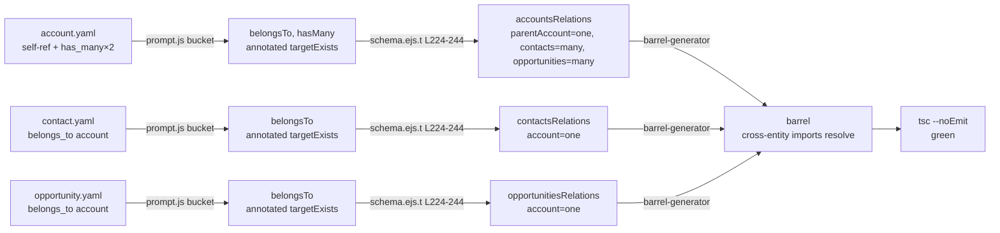

# Relationship pattern: audit + smoke test against crm-domain YAML

## Goal

Verify the Relationship pattern (already shipped upstream in commits `8a5bc13`, `ef5e898`, `269ab3f`, `01bb917`) covers what the wave-1 `crm-domain` stack will need, **without re-implementing it**. Three deliverables, all narrowly scoped:

1. **Audit note** in `docs/` listing each crm-domain relationship shape and the supporting commit.
2. **Cross-entity emission documentation** capturing how a `relationships:` block on entity A causes association methods to materialise on entity B's repo/service/schema — written in enough depth that `junction-association-codegen` (CGP-XX, sibling leaf) can reuse the lever without re-reading the Relationship source.
3. **One smoke test** exercising self-ref `belongs_to` + cross-entity `belongs_to`/`has_many` against a crm-domain-shaped fixture set.

If any gap is uncovered during the audit, **raise a separate issue** rather than expanding scope. This issue is verification, not extension.

## Approach

### Disambiguating the two "Relationship" mechanisms

The four cited commits ship **two distinct things** that share the name "relationship". The audit must distinguish them, because `crm-domain` needs only one of them and `junction-association-codegen` will reuse mechanics from both. The lever for downstream reuse is mechanism (B):

- **(A) First-class relationship definitions** — top-level `definitions/relationships/<name>.yaml` parsed by `loadRelationshipFromYaml()` (`src/utils/yaml-loader.ts:1` onward). These produce their own junction entity via the `templates/relationship/new/` Hygen pipeline (entity + repo + service + DTOs + controller + module + use-cases). Shipped by `8a5bc13` (schema/parser/analyzer) and `ef5e898` (templates + CLI). Discovery + barrel inclusion via `collectRelationships()` in `src/cli/shared/barrel-generator.ts:156`. **`crm-domain` does not use this mechanism.**

- **(B) Per-entity `relationships:` block** — `belongs_to`/`has_many`/`has_one` declared inside an entity YAML. Processed by both backend template pipelines: clean in `templates/entity/new/prompt.js:838-927` and clean-lite-ps in `templates/entity/new/clean-lite-ps/prompt-extension.js:302-410, 769-820`. Predates the four cited commits but `269ab3f` fixed a self-ref `belongs_to` bug in clean-lite-ps. **`crm-domain` uses this mechanism for `Account.parent_account_id`, `Contact.account_id`, `Opportunity.account_id`.** This is also the mechanism `junction-association-codegen` extends.

The audit doc names this distinction explicitly in its opening paragraph so a fresh reader does not lose ninety minutes the same way the spec author did.

### Audit deliverable shape

Single docs file: `docs/relationship-pattern-audit.md`. Two sections:

1. **CRM-domain coverage table** — each row pairs a relationship shape (e.g. "self-ref `belongs_to` on `account.parent_account_id`") to the supporting commit/file/line. Sourced from `dealbrain-integrations/.ai-docs/stacks/crm-domain/plan.yaml` (the `crm-domain-yaml` issue lists every entity and its relationships).
2. **Cross-entity emission mechanism** — see the dedicated subsection below; this is the load-bearing deliverable for `junction-association-codegen`.

### Cross-entity emission mechanism — what to document

`Account.contacts()` materialising on `AccountRepository` is not literal emission — Drizzle's `relations()` helper provides typed navigation at query time. The codegen output is a `<plural>Relations` const on the **declaring** entity's schema file that registers a `many(<otherPlural>)` or `one(<otherPlural>)` callback. The doc must capture all four moving parts:

| Part | Entry point | What it does |
|---|---|---|
| **Per-entity bucketing pass** | `templates/entity/new/prompt.js:838-883` (and the parallel pass at `clean-lite-ps/prompt-extension.js:769-787`) | Reads `entity.relationships`, partitions into `belongsToRelations` / `hasManyRelations` / `hasOneRelations`, derives Pascal/plural/foreign-key permutations once and reuses across templates. |
| **Target-existence check (the "cross-entity gate")** | `prompt.js:887-912` (`checkEntityExists` + `targetExists` marking) | Each relationship is annotated with whether the **target** entity's `<name>.entity.ts` already exists on disk. Templates use this to suppress imports/methods that would dangle. This is why baseline tests two-pass: pass 1 seeds entity files, pass 2 emits with `targetExists: true`. |
| **Drizzle relations emission** | `templates/entity/new/backend/database/schema.ejs.t:224-244` | Emits a single `<plural>Relations = relations(<plural>, ({ one, many }) => ({ ... }))` block on the **declaring** entity's schema file. `belongs_to` emits `one(<targetPlural>, { fields: [...], references: [...] })`; `has_many` emits `many(<targetPlural>)`; `has_one` emits `one(<targetPlural>)`. Drizzle's runtime then exposes `db.query.accounts.findMany({ with: { contacts: true } })` against either side once the inverse is declared on the other entity. |
| **Schema-aware barrel** | `src/cli/shared/barrel-generator.ts:189-244` | Computes module + schema file paths per architecture so cross-entity imports resolve at the right depth (the `01bb917` fix). Junction modules from mechanism (A) are merged with regular modules here — this is the integration seam `junction-association-codegen` extends to surface generated junction repos/services on canonical ports. |

What the doc explicitly **does not** claim: there is no "contribution pass" that walks `contact.yaml` and writes anything into `accounts.entity.ts` or `accounts.repository.ts`. Drizzle's relation graph is bidirectional **only if both entities declare their half**. For `Account.contacts()` to appear, `account.yaml` must declare `relationships.contacts: { type: has_many, target: contact, foreign_key: account_id }` — `contact.yaml`'s `belongs_to: account` alone is insufficient.

This is a **gap relative to the issue's framing**, and the audit doc surfaces it. The remediation path (the implementer chooses one):

- **Option A** — Treat it as expected behaviour: document that `crm-domain` YAML must declare both halves. Cheaper. Matches what `crm-domain/plan.yaml` already prescribes (`account.yaml ... relationships.contacts has_many`).
- **Option B** — File a follow-up issue proposing inverse-relation synthesis (codegen materialises the `has_many` side from the declared `belongs_to`). Out of scope for this leaf.

Pick **A** unless the validator disagrees. Either way the audit note records the decision so `junction-association-codegen` knows: junctions need **both sides** declared at codegen time, or the codegen must synthesise the inverse — this is the design question that leaf will face.

### Smoke test shape

A new smoke fixture set (`test/smoke/fixtures/crm/`) plus a sibling runner (`test/smoke/run-relationship-smoke.ts`) modelled on `test/smoke/run-smoke.ts` (the existing harness scaffolds a tmp project, copies fixtures, runs `codegen entity new --all`, runs `bunx tsc --noEmit`). The runner extends the same harness by parameterising the fixtures dir, OR — preferred — adds a `--scenario relationship` flag to `run-smoke.ts` so the smoke surface stays one entry point. Final shape is the implementer's call; the spec mandates **one harness invocation** so CI cost stays predictable.

Fixtures cover exactly the crm-domain shapes:

- `account.yaml` — self-ref `belongs_to parent_account` on `parent_account_id`. Also declares `relationships.contacts: { type: has_many, target: contact, foreign_key: account_id }` and `relationships.opportunities: { type: has_many, target: opportunity, foreign_key: account_id }`.
- `contact.yaml` — `belongs_to account` on `account_id`.
- `opportunity.yaml` — `belongs_to account` on `account_id`.

Tests pass when:
- `bunx tsc --noEmit` succeeds on the generated project.
- `accounts.entity.ts` contains `parentAccount: one(accounts, ...)` (self-ref relation key derives from FK column per `269ab3f`).
- `accounts.entity.ts` contains `contacts: many(contacts)` and `opportunities: many(opportunities)`.
- `contacts.entity.ts` contains `account: one(accounts, { fields: [contacts.accountId], references: [accounts.id] })`.
- `opportunities.entity.ts` contains the analogous `account: one(accounts, ...)`.

No DB push, no Postgres dependency — schema correctness via TS compile + targeted grep is sufficient for this smoke. The existing `run-smoke.ts` already proves the toolchain composes; this just expands fixture coverage.



## File-level plan

### Create

- `docs/relationship-pattern-audit.md` — the audit + cross-entity emission docs. Single file per the issue's "live in the same docs note as the audit" directive. ~250-400 lines. Cites every claim with `<file>:<line>` per `instructions.yaml.citations.file_paths: required`.
- `test/smoke/fixtures/crm/account.yaml` — self-ref `belongs_to` + two `has_many` (contacts, opportunities). Pattern: `Synced` (matches `crm-domain/plan.yaml` expectation; consistent with the existing `test/smoke/fixtures/account.yaml` baseline).
- `test/smoke/fixtures/crm/contact.yaml` — `belongs_to account`. Shape mirrors the existing `test/smoke/fixtures/contact.yaml` but adds nothing speculative (no junctions — those belong to the sibling Junction leaves).
- `test/smoke/fixtures/crm/opportunity.yaml` — `belongs_to account`. Minimal extra fields (`name`, `amount`, `stage` enum) so DTO emission is exercised non-trivially.

### Modify

- `test/smoke/run-smoke.ts` — add a `--scenario` flag (default `default`, accept `relationship`) that swaps the `FIXTURES_DIR` between `test/smoke/fixtures/` and `test/smoke/fixtures/crm/`. The harness body is unchanged. Roughly +20 lines. **Do not** fork a second runner — every line of smoke-harness drift is a future maintenance tax.
- `justfile` — add `test-smoke-relationship` recipe that invokes `bun test/smoke/run-smoke.ts --scenario relationship`. Wire it into `test-all` so CI runs both scenarios. ~3 lines added.
- `.github/workflows/ci.yml` — no change if `test-all` is the CI entry point (`just test-all` already covers it). Validator confirms.

### Explicitly **not** modified

- `templates/entity/new/prompt.js`, `clean-lite-ps/prompt-extension.js`, `backend/database/schema.ejs.t`, `relationship/new/**`, `src/parser/`, `src/analyzer/`, `src/schema/relationship-definition.schema.ts`, `src/utils/yaml-loader.ts`, `src/cli/commands/relationship.ts`, `src/cli/shared/barrel-generator.ts` — this is verification, not extension. If the audit finds a gap, file a separate issue.

## Interfaces

No new TypeScript interfaces. The deliverable is **prose + fixtures + one CLI flag**. The flag's shape:

```typescript
// test/smoke/run-smoke.ts — additions near top of file, parsed before tmp-dir creation.

type Scenario = 'default' | 'relationship';

const SCENARIO: Scenario = (() => {
  const idx = process.argv.indexOf('--scenario');
  if (idx === -1) return 'default';
  const value = process.argv[idx + 1];
  if (value !== 'default' && value !== 'relationship') {
    console.error(`Unknown --scenario: ${value}. Expected 'default' or 'relationship'.`);
    process.exit(2);
  }
  return value;
})();

const FIXTURES_DIR = SCENARIO === 'relationship'
  ? path.join(REPO_ROOT, 'test', 'smoke', 'fixtures', 'crm')
  : path.join(REPO_ROOT, 'test', 'smoke', 'fixtures');
```

Assertion helpers added near the end of `runSmoke()`:

```typescript
// Only runs under --scenario relationship. The existing scenario keeps its
// single existing assertion (tsc --noEmit succeeds).
function assertRelationshipEmission(generatedSrc: string): void {
  const reads = (p: string): string => fs.readFileSync(path.join(generatedSrc, p), 'utf8');

  const accountSchema = reads('domain/account/account.entity.ts'); // path per clean-lite-ps layout
  assertContains(accountSchema, /parentAccount:\s*one\(accounts,/);
  assertContains(accountSchema, /contacts:\s*many\(contacts\)/);
  assertContains(accountSchema, /opportunities:\s*many\(opportunities\)/);

  const contactSchema = reads('domain/contact/contact.entity.ts');
  assertContains(contactSchema, /account:\s*one\(accounts,\s*\{[\s\S]*fields:\s*\[contacts\.accountId\]/);

  const oppSchema = reads('domain/opportunity/opportunity.entity.ts');
  assertContains(oppSchema, /account:\s*one\(accounts,\s*\{[\s\S]*fields:\s*\[opportunities\.accountId\]/);
}

function assertContains(haystack: string, needle: RegExp): void {
  if (!needle.test(haystack)) {
    throw new Error(`Smoke assertion failed: expected to find ${needle} in generated output.`);
  }
}
```

Path layout under `generatedSrc` is whatever the existing smoke harness already uses for the default scenario — the implementer reads the same path the default scenario reads (do **not** hardcode; mirror existing `verifyTypecheck()` conventions in `run-smoke.ts`). If the default smoke harness uses `domain/<name>/<name>.entity.ts`, this code shape is correct; if it uses a different layout, adjust the constants but keep the regex shape.

## Tests

The smoke test **is** the test. Coverage matrix:

| Shape | Where it lives | How asserted |
|---|---|---|
| Self-ref `belongs_to` (regression of `269ab3f`) | `account.yaml.relationships.parent_account` | `assertRelationshipEmission` regex on `parentAccount: one(accounts, ...)`. Also implicitly: `tsc --noEmit` would fail with TS2300 if the `269ab3f` fix regressed (duplicate `accounts` import). |
| Cross-entity `belongs_to` | `contact.yaml`, `opportunity.yaml` | Regex on `account: one(accounts, { fields: [...accountId], references: [...id] })` in both schema files. |
| Inverse `has_many` (the "Account.contacts() lever") | `account.yaml.relationships.contacts`, `account.yaml.relationships.opportunities` | Regex on `contacts: many(contacts)` and `opportunities: many(opportunities)` in `account.entity.ts`. |
| Barrel-import-depth (regression of `01bb917`) | All three fixtures | `bunx tsc --noEmit` succeeds. Module-resolution failure at the wrong import depth would emit TS2307. |
| Audit doc accuracy | `docs/relationship-pattern-audit.md` | Manually verified during human Gate-1 review. No code assertion possible; this is what Gate 1 is for. |

CI wiring: `just test-all` calls `test-smoke` (existing) + `test-smoke-relationship` (new). Total added CI time: ~60-120s (same harness, same install step). The existing `test-smoke` is preserved untouched so the dogfood-#9 + PR-#28 regressions stay covered.

Unit tests are **not** added. The schema/parser/analyzer paths for first-class relationships already have 48+ tests landed in `8a5bc13`. The per-entity `relationships:` block is exercised by `test-baseline` (`test/fixtures/opportunity.yaml`, `organization.yaml`, etc. all declare `relationships`). No coverage gap that this issue should fill.

## Out of scope

- Any change to template logic, parser, analyzer, or schema. Verification-only.
- Inverse-relation synthesis (auto-emit `has_many` from a declared `belongs_to`). If the validator wants it, it's a separate issue per the acceptance criteria ("If any gap is found, raise it as a separate issue rather than expanding scope here.").
- Junction pattern work — entirely owned by sibling leaves (`junction-pattern-definition`, `junction-hygen-templates`, `junction-association-codegen`, `junction-test-fixtures`).
- Junction-aware barrel generation beyond what `01bb917` already shipped.
- Postgres integration test for relationship FK constraints. The smoke test verifies *codegen output*; FK enforcement is a Drizzle/Postgres responsibility tested by `test-family` (already green).
- `user_integration` from `crm-domain/plan.yaml` — has no relationships in scope; outside this leaf.
- Account_contact / opportunity_contact junctions — those are Junction pattern, not Relationship. Sibling leaves cover them.

## Open questions

- Is the spec author correct that `Account.contacts()` requires `account.yaml` to declare the inverse `has_many` explicitly, and that `contact.yaml`'s `belongs_to: account` alone does **not** auto-synthesise it? Confirm by `git grep` for any inverse-synthesis pass in the codegen pipeline before writing the audit doc. If a synthesis pass exists and the spec missed it, the audit doc's framing changes materially (and Option A above becomes free instead of requiring crm-domain to declare both halves).
- Should the new smoke scenario also assert that the generated **repository** classes expose typed methods for the relationship (e.g. an `accountRepository.findWithContacts()` or similar)? Today's templates emit only the Drizzle relations const, not repository wrapper methods. If they don't, document that `junction-association-codegen` will need to add this layer (this becomes the explicit extension point junction codegen builds on).
- Confirm the smoke project's on-disk layout under `clean-lite-ps`: is it `<projectRoot>/src/modules/<plural>/<name>.entity.ts` or `<projectRoot>/domain/<name>/<name>.entity.ts`? Implementer reads existing `verifyTypecheck()` and matches. The assertion regexes above are shape-correct regardless of path.
- The `crm-domain` plan describes `account.yaml` declaring both `relationships.contacts has_many` AND `account_contact` Junction. Smoke fixtures should declare only the `has_many` (Junction is sibling work) — confirm with the validator that this scope split is acceptable.
- Audit-note location: `docs/relationship-pattern-audit.md` is the spec author's recommendation. The issue allows "appended to the implementation spec" (i.e. `docs/specs/app-defined-patterns-implementation.md`) as an alternative. Spec author chose a standalone file because the audit is verification of an already-merged pattern, not part of an in-flight implementation spec. Validator may override.
